# Software Requirements Specification (SRS)
# Methsara Publications Webstore

**Sri Lanka Institute of Information Technology**

---

## Cover Page

| Field | Details |
|-------|---------|
| **Module Name** | Requirements Engineering |
| **Project Name** | Methsara Publications Webstore |
| **Group ID** | ISP_G05 |
| **Assignment** | Assignment 2 – Advanced Modelling & SRS |
| **Submission Date** | March 2026 |
| **Classification** | Public-SLIIT |

**Group Members:**

| Student ID | Student Name |
|------------|--------------|
| IT24100548 | Galagama S.T |
| IT24101314 | Appuhami H A P L |
| IT24100191 | Jayasinghe D.B.P |
| IT24100799 | Gawrawa G H Y |
| IT24100264 | Bandara N W C D |
| IT24101266 | Perera M.U.E |

---

## 1. Introduction

### 1.1 Project Domain

Methsara Publications is an established educational publishing company in Sri Lanka that specialises in producing high-quality study materials for students in grades 6–13. The company currently operates through three physical locations: Main Branch (headquarters), Balangoda Branch, and Kottawa Branch. Their product catalogue includes textbooks, revision guides, past papers, and exam preparation materials aligned with the Sri Lankan national curriculum (O/L, A/L, Scholarship).

### 1.2 Organisation Background

The organisation has been serving the educational community for several years, building a strong reputation among students, parents, and teachers. However, their current business model relies heavily on traditional brick-and-mortar operations, limiting market reach and operational efficiency.

### 1.3 Existing Problems

**Operational Challenges:**
- **Manual Inventory Management:** Stock tracking across three branches is done manually, leading to frequent discrepancies and inefficient stock transfers
- **Limited Market Reach:** Physical storefront operations restrict customer access to business hours and geographical proximity
- **Procurement Inefficiencies:** Manual purchase order processes create coordination challenges with suppliers and delays in restocking
- **No Real-time Visibility:** Store owners and managers lack real-time insights into stock levels, sales performance, and financial metrics
- **Customer Inconvenience:** Students and parents cannot browse or purchase materials outside business hours or from remote locations

### 1.4 Proposed Solution

The Methsara Publications Webstore is a comprehensive e-commerce platform (MERN stack — MongoDB, Express.js, React.js, Node.js) designed to digitally transform the business operations. The system provides 24/7 online access for customers, unified multi-location inventory management, automated procurement workflows, and data-driven business insights organised into six core Epics:

| Epic | Domain |
|------|--------|
| E1 | User & Role Management |
| E2 | Product Catalogue Management |
| E3 | Order & Transaction Management |
| E4 | Supplier Management |
| E5 | Inventory Management |
| E6 | Promotion & Loyalty Management |

---

## 2. Methodology

### 2.1 Requirements Identification and Elicitation

Our team employed multiple requirements engineering techniques:

**Stakeholder Interviews** — Structured interviews with the business owner, inventory managers, customers (students, parents, teachers), and finance personnel revealed critical needs including multi-location inventory visibility, multiple payment options (COD and bank transfer), role-based access control, and automated stock alerts.

**Document Analysis** — Review of manual inventory ledgers, sample purchase orders, supplier invoices, customer receipts, and existing product catalogues provided insights into existing workflows and data structures.

**Observation** — Direct observation of customer purchasing behaviour, inventory counting, stock transfer processes, and order processing revealed peak demand patterns and operational bottlenecks.

**Workshops & Brainstorming** — Team sessions with the business owner and operational staff produced the six-epic breakdown, user role definitions, and feature prioritisation.

### 2.2 Requirements Documentation

Requirements were documented using:
- IEEE 830-compatible structured tables (ID, description, priority, stakeholder)
- Use case scenarios with main and alternative flows
- Acceptance criteria in Gherkin-style Given/When/Then format
- User stories with MoSCoW prioritisation in the product backlog

### 2.3 Discussion — Difficulties, Limitations, and Lessons Learned

**Difficulties Encountered:**
- Distinguishing between what stakeholders *want* vs. what is technically *feasible* within the project timeline
- Capturing non-functional requirements at a measurable level (e.g., defining specific response time thresholds required research into benchmarks)
- Modelling complex multi-location inventory flows where the same product exists at three different locations simultaneously

**Limitations:**
- Analysis was based on a hypothetical client scenario; actual stakeholder interviews were simulated through document analysis and domain research
- The scope was limited to web-based access; mobile applications were deliberately excluded from Phase 1

**Lessons Learned:**
- Early stakeholder involvement prevents costly requirement changes later
- UML modelling reveals gaps and ambiguities in textual requirements that are not immediately obvious
- Separating structural, behavioural, and flow models provides complementary perspectives on the same system
- Decision tables and trees are powerful tools for capturing complex conditional business logic clearly

---

## 3. Refined List of Functional Requirements (FR)

> Requirements are refined and verified against the implemented MERN codebase.

### FR1: User & Admin Management

| ID | Requirement | Priority | Stakeholder | Implementation Note |
|----|-------------|----------|-------------|---------------------|
| FR1.1 | The system shall allow customers to self-register with name, email, password, and phone. The account shall be immediately activated and a JWT issued for direct login. | High | Students, Parents, Teachers | **[UPDATED]** — Email verification removed; `isEmailVerified` defaults to `true`. Email verification is a Phase 2 feature. |
| FR1.2 | The system shall provide secure login with JWT session management. Deactivated accounts shall be blocked from login. | High | All Users | Implemented ✓ |
| FR1.3 | The system shall allow customers to manage their profiles (name, delivery addresses, phone). | High | Students, Parents, Teachers | Implemented ✓ |
| FR1.4 | The system shall allow System Administrators to create staff accounts with assigned roles (admin, product_manager, finance_manager, supplier_manager, master_inventory_manager, location_inventory_manager, marketing_manager). | High | System Administrator | Implemented ✓ |
| FR1.5 | The system shall allow System Administrators to assign staff members to specific branch locations. | High | System Administrator | Implemented ✓ |
| FR1.6 | The system shall enforce Role-Based Access Control (RBAC) — all API endpoints protected by JWT middleware that validates role and permissions. | High | System Administrator | Implemented ✓ |
| FR1.7 | The system shall provide a password reset mechanism: the user submits their email, a 6-digit SHA-256 hashed token with 1-hour expiry is generated, and the user submits the token with a new password to complete the reset. | Medium | All Users | **[UPDATED]** — Token returned in API response (not emailed). Email-based delivery is a Phase 2 feature. |
| FR1.8 | The system shall force staff to change their password on first login. The `mustChangePassword` flag is set to `true` on account creation and cleared after the first password change. | Medium | Staff Members | Implemented ✓ |
| FR1.9 | The system shall allow System Administrators to view, search, and filter all user accounts (customers and staff). | Medium | System Administrator | Implemented ✓ |
| FR1.10 | The system shall allow System Administrators to deactivate user accounts. Administrators cannot deactivate their own account. | Medium | System Administrator | Implemented ✓ |
| FR1.11 | The system shall maintain security audit logs: login history and session records (IP address, device, browser, login timestamp). | Low | System Administrator | Implemented ✓ — `Session` collection with UA-Parser device detection. |
| FR1.12 | The system shall allow customers to manage multiple saved delivery addresses. | Medium | Students, Parents, Teachers | Implemented ✓ |
| FR1.13 | The system shall allow authenticated users to view active sessions (device, browser, IP) and revoke individual sessions remotely. | Medium | All Users | **[NEW]** — Identified and implemented during development. |

> **Assumption on Email Services:** Email-based verification and password reset token delivery via email are deferred to Phase 2 due to SMTP infrastructure constraints. All other security properties (bcrypt hashing, JWT, RBAC, session tracking) are fully implemented in Phase 1.

### FR2: Product Catalogue Management

| ID | Requirement | Priority | Stakeholder | Implementation Note |
|----|-------------|----------|-------------|---------------------|
| FR2.1 | The system shall allow Product Managers to create and update products (title in English & Sinhala, author, ISBN, description, price, grade, subject, exam type, featured/flash-sale flags). | High | Product Manager | Implemented ✓ |
| FR2.2 | The system shall allow Product Managers to upload a main product image and a back-cover image per product. | High | Product Manager | Implemented ✓ |
| FR2.3 | The system shall allow Product Managers to categorise products by Grade (6–13, Other), Subject, and Exam Type (O/L, A/L, Scholarship, General). | High | Product Manager | Implemented ✓ |
| FR2.4 | The system shall allow customers to search for products by title, author, or ISBN. | High | Students, Parents, Teachers | Implemented ✓ |
| FR2.5 | The system shall allow customers to filter products by Grade, Subject, Exam Type, and Price range. | High | Students, Parents, Teachers | Implemented ✓ |
| FR2.6 | The system shall display detailed product information including images, description, price, stock status, average rating, and total review count. | High | Students, Parents, Teachers | Implemented ✓ |
| FR2.7 | The system shall allow customers to sort products by price (asc/desc), popularity, and newest arrivals. | Medium | Students, Parents, Teachers | Implemented ✓ |
| FR2.8 | The system shall allow customers to submit one review per product (1–5 stars, title, comment). Reviews are moderated before display. | Medium | Students, Parents, Teachers | Implemented ✓ |
| FR2.9 | The system shall allow Product Managers to approve, reject, and remove product reviews. | Low | Product Manager | Implemented ✓ |
| FR2.10 | The system shall display related products based on the same grade and subject category. | Low | Students, Parents, Teachers | Implemented ✓ |

### FR3: Order & Transaction Management

| ID | Requirement | Priority | Stakeholder | Implementation Note |
|----|-------------|----------|-------------|---------------------|
| FR3.1 | The system shall allow customers (registered or guest) to add products to a shopping cart. | High | Students, Parents, Teachers | Implemented ✓ |
| FR3.2 | The system shall allow customers to view, update quantities, and remove items from the cart. | High | Students, Parents, Teachers | Implemented ✓ |
| FR3.3 | The system shall support Cash on Delivery (COD) as a payment method. | High | Students, Parents, Teachers | Implemented ✓ |
| FR3.4 | The system shall allow customers to upload a bank transfer slip image as payment proof. | High | Students, Parents, Teachers | Implemented ✓ |
| FR3.5 | The system shall support guest checkout (guest name and email required; no account needed). | Medium | Students, Parents, Teachers | Implemented ✓ |
| FR3.6 | The system shall allow registered customers to view their full order history with status and payment details. | Medium | Students, Parents, Teachers | Implemented ✓ |
| FR3.7 | The system shall allow customers to track order status: Pending → Processing → Shipped → Delivered. | High | Students, Parents, Teachers | Implemented ✓ |
| FR3.8 | The system shall allow administrators to update order status and payment status. | High | System Administrator | Implemented ✓ |
| FR3.9 | The system shall provide a financial dashboard showing real-time revenue, transaction summaries, and sales analytics. | Medium | Finance Manager | Implemented ✓ |
| FR3.10 | The system shall generate invoices for completed orders. | Medium | Finance Manager | Implemented ✓ |
| FR3.11 | The system shall allow Finance Managers to process and record customer refunds. | Low | Finance Manager | Implemented ✓ |
| FR3.12 | The system shall validate and apply coupon or gift voucher discounts at checkout before order confirmation. | High | Students, Parents, Teachers | Implemented ✓ |

### FR4: Supplier Management

| ID | Requirement | Priority | Stakeholder | Implementation Note |
|----|-------------|----------|-------------|---------------------|
| FR4.1 | The system shall allow Supplier Managers to create and update supplier profiles (name, contact person, email, phone, category, address, payment terms, credit limit, bank details). | High | Supplier Manager | Implemented ✓ |
| FR4.2 | The system shall allow Supplier Managers to create Purchase Orders (POs) with product line items, quantities, unit prices, delivery date, and target branch location. | High | Supplier Manager | Implemented ✓ |
| FR4.3 | The system shall allow Supplier Managers to track PO status: Draft → Sent → Confirmed → Received → Cancelled. | High | Supplier Manager | Implemented ✓ |
| FR4.4 | The system shall allow Supplier Managers to mark POs as Sent. *(Automated email dispatch of PO documents to suppliers is a Phase 2 feature.)* | Medium | Supplier Manager | **[UPDATED]** — PO status updated to "Sent" on dispatch; automated email delivery deferred to Phase 2. |
| FR4.5 | The system shall allow Supplier Managers to link products to specific suppliers with pricing information. | Medium | Supplier Manager | Implemented ✓ |
| FR4.6 | The system shall allow Inventory Managers to confirm receipt of PO deliveries, supporting full and partial receipts and damage recording. | High | Supplier Manager, Inventory Manager | Implemented ✓ |

### FR5: Inventory Management

| ID | Requirement | Priority | Stakeholder | Implementation Note |
|----|-------------|----------|-------------|---------------------|
| FR5.1 | The system shall allow Location-Specific Inventory Managers to view real-time stock levels (quantity, reserved, available) for their assigned location only. | High | Location Inventory Manager | Implemented ✓ |
| FR5.2 | The system shall allow the Master Inventory Manager to view aggregated stock levels across ALL branch locations. | High | Master Inventory Manager | Implemented ✓ |
| FR5.3 | The system shall allow Location Managers to manually adjust stock with a reason code (damage, loss, found stock, correction). All adjustments logged with timestamp and user. | High | Location Inventory Manager | Implemented ✓ |
| FR5.4 | The system shall allow Location Managers to submit inter-branch stock transfer requests (product, quantity, source branch, reason). | Medium | Location Inventory Manager | Implemented ✓ |
| FR5.5 | The system shall allow Location Managers to approve or reject incoming stock transfer requests. Approved transfers atomically update both branch inventories. | Medium | Location Inventory Manager | Implemented ✓ |
| FR5.6 | The system shall allow Location Managers to confirm receipt of PO stock, updating inventory levels at the delivery branch. | High | Location Inventory Manager | Implemented ✓ |
| FR5.7 | The system shall automatically and atomically deduct ordered quantities from the fulfilment location's inventory when an order is confirmed. | High | System | Implemented ✓ |
| FR5.8 | The system shall flag products as low-stock when available quantity falls below the defined threshold (default: 10 units) and display alerts to managers. | Medium | Location Inventory Manager | Implemented ✓ |
| FR5.9 | The system shall allow Inventory Managers to generate stock movement and adjustment history reports for their location. | Low | Location Inventory Manager | Implemented ✓ |

### FR6: Promotion & Loyalty Management

| ID | Requirement | Priority | Stakeholder | Implementation Note |
|----|-------------|----------|-------------|---------------------|
| FR6.1 | The system shall allow Marketing Managers to create discount coupons with configurable rules: discount type (percentage/fixed), discount value, maximum cap, minimum purchase amount, grade and product restrictions. | High | Marketing Manager | Implemented ✓ |
| FR6.2 | The system shall allow Marketing Managers to set coupon validity date ranges (validFrom, validUntil). | Medium | Marketing Manager | Implemented ✓ |
| FR6.3 | The system shall allow Marketing Managers to track coupon usage analytics (total uses, per-user usage, usage history with order references). | Medium | Marketing Manager | Implemented ✓ |
| FR6.4 | The system shall allow Marketing Managers to create and issue gift vouchers with a fixed monetary value, recipient details, and expiry date. Vouchers support partial redemption across multiple orders. | Low | Marketing Manager | Implemented ✓ |
| FR6.5 | The system shall allow Marketing Managers to create seasonal promotional campaigns linked to products or categories. | Low | Marketing Manager | Implemented ✓ |
| FR6.6 | The system shall validate coupons at checkout through five sequential checks: code existence, active status, validity dates, minimum purchase amount, and usage limits (total and per-user). | High | System | Implemented ✓ |

---

## 4. Refined Non-Functional Requirements (NFR)

> NFRs are refined based on the implemented MERN stack and deployment environment. Status reflects Phase 1 completion.

| ID | Category | Requirement | Priority | Measurement Criteria | Status |
|----|----------|-------------|----------|---------------------|--------|
| NFR1.1 | Performance | Product search results returned within 500 ms | High | Response time < 500 ms for 95% of search queries | Planned ✓ |
| NFR1.2 | Performance | System supports ≥ 500 concurrent users | High | Load testing validates response time under 500 concurrent connections | Planned ✓ |
| NFR1.3 | Performance | Checkout transactions complete within 3 seconds | High | End-to-end time < 3 s including stock deduction and confirmation | Implemented ✓ |
| NFR1.4 | Performance | Product images load within 2 seconds | Medium | Images from `/uploads/` delivered < 2 s for 90% of requests | Implemented ✓ |
| NFR2.1 | Security | All passwords hashed using bcrypt before storage | High | 100% of passwords stored as bcrypt hashes (rounds ≥ 10) | Implemented ✓ |
| NFR2.2 | Security | HTTPS enforced on all API communications in production | High | All endpoints use SSL/TLS in production deployment | Planned ✓ |
| NFR2.3 | Security | JWT tokens expire after defined period; sessions are trackable and revocable per device | High | JWT expiry configured; `Session` collection enables per-device revocation | Implemented ✓ |
| NFR2.4 | Security | Deactivated accounts blocked from login regardless of password correctness | High | `isActive` check in `authController.js` performed after password validation | Implemented ✓ |
| NFR2.5 | Security | All critical operations logged with user reference and timestamp | High | Audit trail in `Session`, `Inventory.adjustments`, PO `statusHistory` | Implemented ✓ |
| NFR2.6 | Security | Uploaded bank slips stored server-side with access restricted to authorised staff | High | Files in `/uploads/`; RBAC middleware controls access | Implemented ✓ |
| NFR3.1 | Usability | UI fully responsive on desktop, tablet, and mobile | High | React frontend adapts to screen widths 320 px–1920 px | Implemented ✓ |
| NFR3.2 | Usability | All validation failures return clear, actionable error messages | High | All 4xx API responses include descriptive `message` field | Implemented ✓ |
| NFR3.3 | Usability | New customers can complete first purchase within 5 minutes | Medium | 80% success rate in user testing without prior training | Planned ✓ |
| NFR4.1 | Reliability | 99.5% uptime during business hours (6 AM–10 PM Sri Lanka time) | High | Monthly uptime ≥ 99.5% via cloud monitoring | Planned ✓ |
| NFR4.2 | Reliability | Automated daily database backups | High | MongoDB Atlas automated backups show 100% success in logs | Planned ✓ |
| NFR4.3 | Reliability | System recovers from failures within 1 hour | Medium | MTTR < 1 hour | Planned ✓ |
| NFR5.1 | Scalability | New branch locations addable via admin panel without code changes | Medium | `Location` documents configurable at runtime through admin UI | Implemented ✓ |
| NFR5.2 | Scalability | API layer supports horizontal scaling | Medium | Stateless JWT authentication enables load-balancer readiness | Designed ✓ |
| NFR6.1 | Maintainability | Code follows industry conventions with inline documentation | High | All controllers include Epic/Feature comment headers; code review ≥ 90% | Implemented ✓ |
| NFR6.2 | Maintainability | All API endpoints fully documented with request/response examples | High | Each Epic's `README.md` contains full endpoint reference table | Implemented ✓ |
| NFR6.3 | Maintainability | Modular Epic-based architecture with clear component boundaries | High | 6 Epics with independent routes, controllers, and models | Implemented ✓ |
| NFR7.1 | Compliance | System complies with Sri Lankan data protection regulations | High | Legal review confirms compliance; privacy policy documented | Planned ✓ |
| NFR7.2 | Compliance | Financial records retained for audit purposes (minimum 7 years) | High | MongoDB data retention policy; no automated deletion | Planned ✓ |

---

## 5. Constraints

| ID | Constraint | Type | Rationale / Impact |
|----|------------|------|---------------------|
| C1 | Web-based only; compatible with Chrome, Firefox, Safari, Edge (latest 2 versions) | Technical | Ensures broad accessibility without native app development; limits to browser-compatible technologies |
| C2 | Payment limited to COD and Bank Transfer in Phase 1 — no credit/debit card integration | Business | Reduces integration complexity; COD is prevalent in the Sri Lankan market |
| C3 | Email delivery (SMTP) for verification emails and password reset tokens deferred to Phase 2 | Technical | Registration and password reset function without email; reset token returned in API response during development |
| C4 | Deployable on cloud infrastructure (AWS, Azure, or GCP) | Technical | Enables scalability and high availability; requires cloud-compatible and containerised architecture |
| C5 | Fully implemented within 16 weeks (4 sprints × 4 weeks each) | Business | Requires MoSCoW prioritisation; non-critical features deferred to Phase 2 |
| C6 | Three initial branch locations: Main Branch, Balangoda Branch, Kottawa Branch | Business | Defines minimum `Location` and `Inventory` data model; additional branches must be runtime-configurable |
| C7 | Product catalogue structure must maintain Grade / Subject / Exam Type categorisation | Business | Ensures continuity with existing physical catalogue and customer expectations |
| C8 | Must comply with Sri Lankan e-commerce tax regulations | Regulatory | Requires tax calculation and reporting in financial dashboard and invoices |
| C9 | Customer personal data must comply with Sri Lankan data privacy regulations | Regulatory | Constrains data storage, retention, and deletion policies; requires published privacy policy |

---

## 6. Structural Models

### 6.1 UML Class Diagram

The following PlantUML code describes the complete class diagram for the Methsara Publications Webstore. It includes all 10 major domain classes with their key attributes and all inter-class relationships.


```plantuml
@startuml
title Core Domain Class Diagram
skinparam classAttributeIconSize 0
skinparam classFontSize 12
skinparam linetype ortho
hide empty members

class User {
  - _id : ObjectId
  - name : String
  - email : String <<unique>>
  - password : String (hashed)
  - phone : String
  - userType : String
  - role : String
  - assignedLocation : String
  - nic : String <<unique, sparse>>
  - isActive : Boolean
  - isEmailVerified : Boolean
  - deliveryAddresses : Address[]
  - lastLogin : Date
  - createdAt : Date
  + register() : void
  + login() : String (JWT)
  + updateProfile() : void
  + resetPassword() : void
  + deactivate() : void
}

class Product {
  - _id : ObjectId
  - title : String
  - titleSinhala : String
  - author : String
  - isbn : String <<unique>>
  - description : String
  - price : Number
  - grade : String
  - subject : String
  - examType : String
  - stock : Number
  - image : String
  - averageRating : Number
  - totalReviews : Number
  - isActive : Boolean
  - isFeatured : Boolean
  - isFlashSale : Boolean
  - createdAt : Date
  + create() : void
  + update() : void
  + archive() : void
  + calculateAverageRating() : Number
}

class Review {
  - _id : ObjectId
  - rating : Integer (1-5)
  - title : String
  - comment : String
  - status : String
  - helpfulVotes : Integer
  - adminResponse : String
  - createdAt : Date
  + submit() : void
  + moderate() : void
  + markHelpful() : void
}

class Order {
  - _id : ObjectId
  - guestEmail : String
  - guestName : String
  - items : OrderItem[]
  - subtotal : Number
  - deliveryFee : Number
  - discount : Number
  - couponCode : String
  - couponDiscount : Number
  - total : Number
  - deliveryAddress : Address
  - paymentMethod : String
  - paymentStatus : String
  - orderStatus : String
  - fulfillmentLocation : String
  - orderDate : Date
  - deliveryDate : Date
  + place() : void
  + updateStatus() : void
  + cancel() : void
  + generateInvoice() : void
}

class Supplier {
  - _id : ObjectId
  - name : String
  - contactPerson : String
  - email : String
  - phone : String
  - category : String
  - address : Address
  - paymentTerms : String
  - creditLimit : Number
  - outstandingBalance : Number
  - isActive : Boolean
  - rating : Number
  - createdAt : Date
  + create() : void
  + update() : void
  + deactivate() : void
}

class PurchaseOrder {
  - _id : ObjectId
  - poNumber : String <<unique>>
  - items : POItem[]
  - totalAmount : Number
  - status : String
  - paymentStatus : String
  - location : String
  - expectedDeliveryDate : Date
  - actualDeliveryDate : Date
  - notes : String
  - createdAt : Date
  + create() : void
  + sendToSupplier() : void
  + confirmReceipt() : void
  + cancel() : void
}

class Inventory {
  - _id : ObjectId
  - location : String
  - quantity : Integer
  - reservedQuantity : Integer
  - availableQuantity : Integer
  - lowStockThreshold : Integer
  - reorderPoint : Integer
  - isLowStock : Boolean
  - isOutOfStock : Boolean
  - lastRestockDate : Date
  - adjustments : Adjustment[]
  + adjustStock() : void
  + deductStock() : void
  + checkLowStock() : Boolean
  + generateReport() : void
}

class Location {
  - _id : ObjectId
  - name : String <<unique>>
  - address : String
  - contactNumber : String
  - status : String
  - isMainWarehouse : Boolean
  - createdAt : Date
  + create() : void
  + update() : void
  + deactivate() : void
}

class Coupon {
  - _id : ObjectId
  - code : String <<unique>>
  - discountType : String
  - discountValue : Number
  - maxDiscount : Number
  - minPurchaseAmount : Number
  - maxUsageCount : Integer
  - currentUsageCount : Integer
  - validFrom : Date
  - validUntil : Date
  - applicableGrades : String[]
  - isActive : Boolean
  - usageHistory : CouponUsage[]
  - createdAt : Date
  + validate() : Boolean
  + apply() : Number
  + deactivate() : void
}

class GiftVoucher {
  - _id : ObjectId
  - code : String <<unique>>
  - value : Number
  - balance : Number
  - recipientEmail : String
  - recipientName : String
  - message : String
  - isActive : Boolean
  - expiryDate : Date
  - usageHistory : VoucherUsage[]
  - createdAt : Date
  + validate() : Boolean
  + redeem() : Number
  + checkBalance() : Number
}

class StockTransfer {
  - _id : ObjectId
  - transferNumber : String <<unique>>
  - fromLocation : String
  - toLocation : String
  - quantity : Integer
  - status : String
  - reason : String
  - priority : String
  - requestedAt : Date
  - approvedAt : Date
  + request() : void
  + approve() : void
  + reject() : void
  + complete() : void
}

' Relationships
User "1" --> "0..*" Order : places
User "1" --> "0..*" Review : writes
User "1" --> "0..*" PurchaseOrder : creates
User "1" --> "0..1" Location : manages
Product "1" --> "0..*" Review : receives
Product "0..*" --> "0..1" Supplier : supplied_by
Product "1" --> "0..*" Inventory : tracked_in
Order "0..*" --> "0..*" Product : contains
Supplier "1" --> "0..*" PurchaseOrder : fulfills
PurchaseOrder "0..*" --> "0..*" Product : orders
Location "1" --> "0..*" Inventory : holds
Coupon "0..*" --> "0..*" Product : restricts
GiftVoucher "0..*" --> "0..1" User : purchased_by
StockTransfer "0..*" --> "1" Product : transfers

@enduml
```

**Commentary:** The class diagram shows 12 domain classes. `User` is the central actor, linked to `Order`, `Review`, `PurchaseOrder`, and `Location`. `Product` connects to `Review`, `Inventory`, `Supplier`, and appears in both `Order` and `PurchaseOrder` as embedded items. `Inventory` is scoped per `Location`, enabling multi-branch stock tracking. `Coupon` and `GiftVoucher` support the promotion system.

---

### 6.2 UML Physical (Deployment) Diagram

The following diagram shows the physical deployment architecture of the Methsara Publications Webstore.

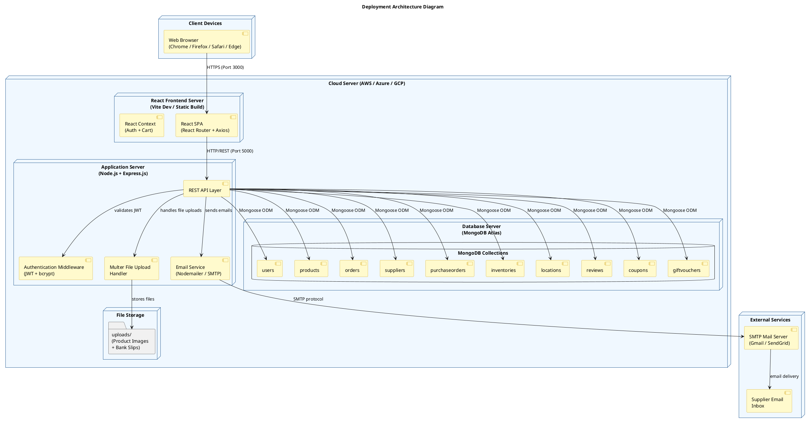
```plantuml
@startuml
title Deployment Architecture Diagram
skinparam node {
  BackgroundColor #f0f8ff
  BorderColor #336699
}
skinparam component {
  BackgroundColor #fffacd
  BorderColor #cc9900
}

node "Client Devices" {
  component [Web Browser\n(Chrome / Firefox / Safari / Edge)] as Browser
}

node "Cloud Server (AWS / Azure / GCP)" {
  node "Application Server\n(Node.js + Express.js)" {
    component [REST API Layer] as API
    component [Authentication Middleware\n(JWT + bcrypt)] as Auth
    component [Multer File Upload\nHandler] as Upload
    component [Email Service\n(Nodemailer / SMTP)] as Email
  }

  node "React Frontend Server\n(Vite Dev / Static Build)" {
    component [React SPA\n(React Router + Axios)] as React
    component [React Context\n(Auth + Cart)] as Context
  }

  node "Database Server\n(MongoDB Atlas)" {
    database "MongoDB Collections" {
      [users]
      [products]
      [orders]
      [suppliers]
      [purchaseorders]
      [inventories]
      [locations]
      [reviews]
      [coupons]
      [giftvouchers]
    }
  }

  node "File Storage" {
    folder "uploads/\n(Product Images\n+ Bank Slips)" as FileStore
  }
}

node "External Services" {
  component [SMTP Mail Server\n(Gmail / SendGrid)] as SMTP
  component [Supplier Email\nInbox] as SupplierEmail
}

Browser --> React : HTTPS (Port 3000)
React --> API : HTTP/REST (Port 5000)
API --> Auth : validates JWT
API --> Upload : handles file uploads
Upload --> FileStore : stores files
API --> Email : sends emails
Email --> SMTP : SMTP protocol
SMTP --> SupplierEmail : email delivery
API --> [users] : Mongoose ODM
API --> [products] : Mongoose ODM
API --> [orders] : Mongoose ODM
API --> [inventories] : Mongoose ODM
API --> [suppliers] : Mongoose ODM
API --> [purchaseorders] : Mongoose ODM
API --> [locations] : Mongoose ODM
API --> [coupons] : Mongoose ODM
API --> [giftvouchers] : Mongoose ODM
API --> [reviews] : Mongoose ODM

@enduml
```

**Commentary:** The system is deployed on a cloud server with two server ports: port 3000 for the React frontend (Vite) and port 5000 for the Node.js/Express REST API. MongoDB Atlas provides the cloud-hosted NoSQL database, accessed via Mongoose ODM. A local `uploads/` directory stores product images and bank transfer proof files. External SMTP is used for customer emails, password resets, and sending purchase orders to suppliers.

---

## 7. Behavioural Models

### 7.1 UML Sequence Diagram — UC1: Admin Creates a Staff Account (FR1.4)

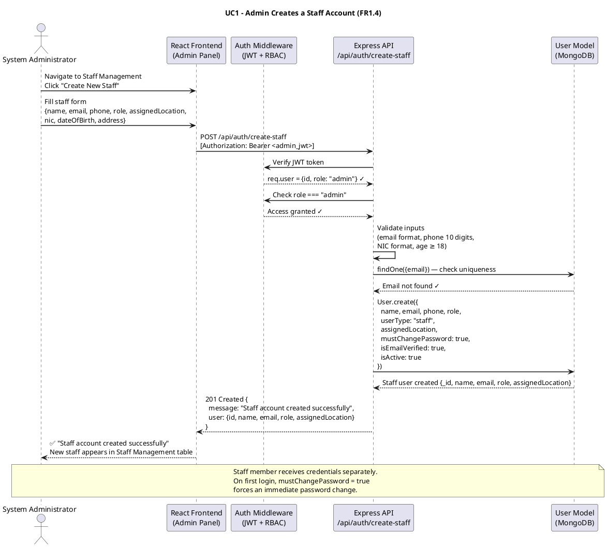
```plantuml
@startuml
title UC1 - Admin Creates a Staff Account (FR1.4)
skinparam sequenceArrowThickness 1.5
actor "System Administrator" as Admin
participant "React Frontend\n(Admin Panel)" as FE
participant "Auth Middleware\n(JWT + RBAC)" as MW
participant "Express API\n/api/auth/create-staff" as API
participant "User Model\n(MongoDB)" as DB

Admin -> FE: Navigate to Staff Management\nClick "Create New Staff"
Admin -> FE: Fill staff form\n{name, email, phone, role, assignedLocation,\nnic, dateOfBirth, address}
FE -> API: POST /api/auth/create-staff\n[Authorization: Bearer <admin_jwt>]
API -> MW: Verify JWT token
MW --> API: req.user = {id, role: "admin"} ✓
API -> MW: Check role === "admin"
MW --> API: Access granted ✓
API -> API: Validate inputs\n(email format, phone 10 digits,\nNIC format, age ≥ 18)
API -> DB: findOne({email}) — check uniqueness
DB --> API: Email not found ✓
API -> DB: User.create({\n  name, email, phone, role,\n  userType: "staff",\n  assignedLocation,\n  mustChangePassword: true,\n  isEmailVerified: true,\n  isActive: true\n})
DB --> API: Staff user created {_id, name, email, role, assignedLocation}
API --> FE: 201 Created {\n  message: "Staff account created successfully",\n  user: {id, name, email, role, assignedLocation}\n}
FE --> Admin: ✅ "Staff account created successfully"\nNew staff appears in Staff Management table

note over Admin, DB
  Staff member receives credentials separately.
  On first login, mustChangePassword = true
  forces an immediate password change.
end note

@enduml
```

**Commentary:** This diagram illustrates FR1.4 — the admin's ability to create role-specific staff accounts. The flow demonstrates two key security layers: the JWT middleware validates the admin's token, and the RBAC check ensures only `admin`-role users can reach this endpoint. Server-side validation checks email format, phone (10 digits), NIC format, and age (≥ 18 years). The `mustChangePassword: true` flag ensures the staff member sets their own password on first login (FR1.8).

---

### 7.2 UML Sequence Diagram — UC2: Product Search & Filtering (FR2.4)

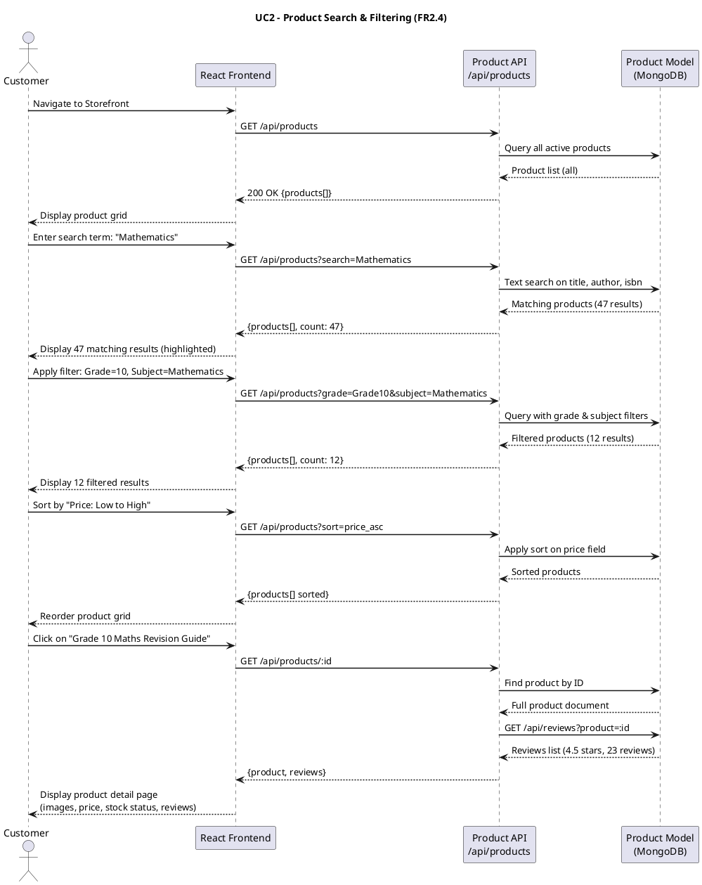
```plantuml
@startuml
title UC2 - Product Search & Filtering (FR2.4)
skinparam sequenceArrowThickness 1.5
actor Customer
participant "React Frontend" as FE
participant "Product API\n/api/products" as API
participant "Product Model\n(MongoDB)" as DB

Customer -> FE: Navigate to Storefront
FE -> API: GET /api/products
API -> DB: Query all active products
DB --> API: Product list (all)
API --> FE: 200 OK {products[]}
FE --> Customer: Display product grid

Customer -> FE: Enter search term: "Mathematics"
FE -> API: GET /api/products?search=Mathematics
API -> DB: Text search on title, author, isbn
DB --> API: Matching products (47 results)
API --> FE: {products[], count: 47}
FE --> Customer: Display 47 matching results (highlighted)

Customer -> FE: Apply filter: Grade=10, Subject=Mathematics
FE -> API: GET /api/products?grade=Grade10&subject=Mathematics
API -> DB: Query with grade & subject filters
DB --> API: Filtered products (12 results)
API --> FE: {products[], count: 12}
FE --> Customer: Display 12 filtered results

Customer -> FE: Sort by "Price: Low to High"
FE -> API: GET /api/products?sort=price_asc
API -> DB: Apply sort on price field
DB --> API: Sorted products
API --> FE: {products[] sorted}
FE --> Customer: Reorder product grid

Customer -> FE: Click on "Grade 10 Maths Revision Guide"
FE -> API: GET /api/products/:id
API -> DB: Find product by ID
DB --> API: Full product document
API -> DB: GET /api/reviews?product=:id
DB --> API: Reviews list (4.5 stars, 23 reviews)
API --> FE: {product, reviews}
FE --> Customer: Display product detail page\n(images, price, stock status, reviews)

@enduml
```

**Commentary:** This sequence shows product discovery as a series of progressive refinements. The first request loads the full catalogue; each subsequent call applies additional query parameters (`search`, `grade`, `subject`, `sort`) to narrow results. Selecting a product triggers two parallel data fetches — product details and its associated reviews — which are combined before display.

---

### 7.3 UML Sequence Diagram — UC3: Place Order with COD & Coupon (FR3.12)

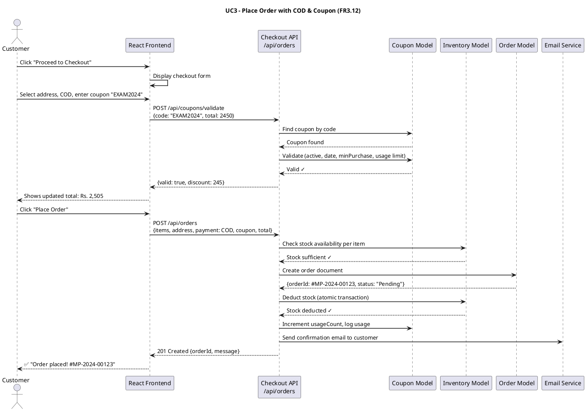
```plantuml
@startuml
title UC3 - Place Order with COD & Coupon (FR3.12)
skinparam sequenceArrowThickness 1.5
actor Customer
participant "React Frontend" as FE
participant "Checkout API\n/api/orders" as API
participant "Coupon Model" as Coupon
participant "Inventory Model" as Inv
participant "Order Model" as Order
participant "Email Service" as Email

Customer -> FE: Click "Proceed to Checkout"
FE -> FE: Display checkout form
Customer -> FE: Select address, COD, enter coupon "EXAM2024"
FE -> API: POST /api/coupons/validate\n{code: "EXAM2024", total: 2450}
API -> Coupon: Find coupon by code
Coupon --> API: Coupon found
API -> Coupon: Validate (active, date, minPurchase, usage limit)
Coupon --> API: Valid ✓
API --> FE: {valid: true, discount: 245}
FE --> Customer: Shows updated total: Rs. 2,505

Customer -> FE: Click "Place Order"
FE -> API: POST /api/orders\n{items, address, payment: COD, coupon, total}
API -> Inv: Check stock availability per item
Inv --> API: Stock sufficient ✓
API -> Order: Create order document
Order --> API: {orderId: #MP-2024-00123, status: "Pending"}
API -> Inv: Deduct stock (atomic transaction)
Inv --> API: Stock deducted ✓
API -> Coupon: Increment usageCount, log usage
API -> Email: Send confirmation email to customer
API --> FE: 201 Created {orderId, message}
FE --> Customer: ✅ "Order placed! #MP-2024-00123"

@enduml
```

**Commentary:** This sequence shows the atomicity of order placement: stock deduction and order creation succeed or fail together. Coupon validation is a separate pre-check. The system prevents overselling by checking real-time inventory before confirming.

---

### 7.4 UML Sequence Diagram — UC4: Create Purchase Order & Receive Stock (FR4.2)

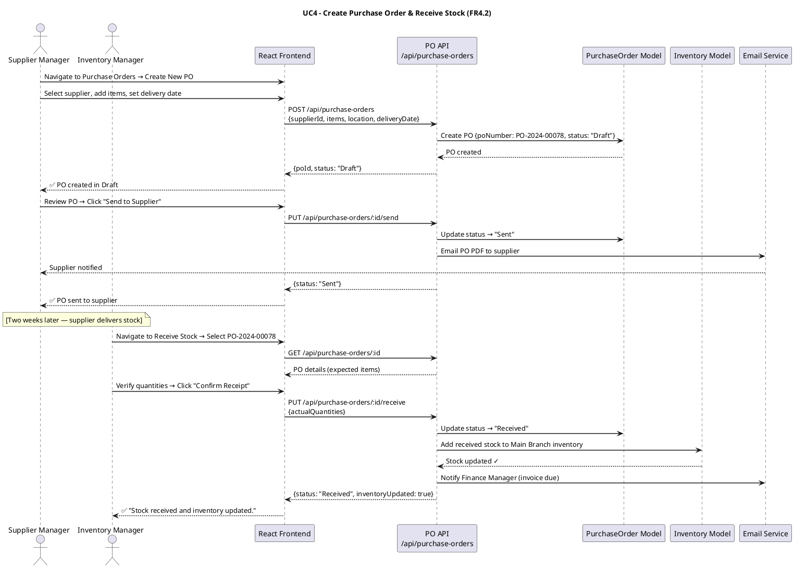
```plantuml
@startuml
title UC4 - Create Purchase Order & Receive Stock (FR4.2)
skinparam sequenceArrowThickness 1.5
actor "Supplier Manager" as SM
actor "Inventory Manager" as IM
participant "React Frontend" as FE
participant "PO API\n/api/purchase-orders" as API
participant "PurchaseOrder Model" as PO
participant "Inventory Model" as Inv
participant "Email Service" as Email

SM -> FE: Navigate to Purchase Orders → Create New PO
SM -> FE: Select supplier, add items, set delivery date
FE -> API: POST /api/purchase-orders\n{supplierId, items, location, deliveryDate}
API -> PO: Create PO {poNumber: PO-2024-00078, status: "Draft"}
PO --> API: PO created
API --> FE: {poId, status: "Draft"}
FE --> SM: ✅ PO created in Draft

SM -> FE: Review PO → Click "Send to Supplier"
FE -> API: PUT /api/purchase-orders/:id/send
API -> PO: Update status → "Sent"
API -> Email: Email PO PDF to supplier
Email --> SM: Supplier notified
API --> FE: {status: "Sent"}
FE --> SM: ✅ PO sent to supplier

note over SM, IM: [Two weeks later — supplier delivers stock]

IM -> FE: Navigate to Receive Stock → Select PO-2024-00078
FE -> API: GET /api/purchase-orders/:id
API --> FE: PO details (expected items)
IM -> FE: Verify quantities → Click "Confirm Receipt"
FE -> API: PUT /api/purchase-orders/:id/receive\n{actualQuantities}
API -> PO: Update status → "Received"
API -> Inv: Add received stock to Main Branch inventory
Inv --> API: Stock updated ✓
API -> Email: Notify Finance Manager (invoice due)
API --> FE: {status: "Received", inventoryUpdated: true}
FE --> IM: ✅ "Stock received and inventory updated."

@enduml
```

**Commentary:** This diagram shows the full purchase order lifecycle from draft creation through supplier notification to stock receipt. When the inventory manager confirms receipt, stock is automatically added to the designated branch inventory, and the Finance Manager is notified to process the supplier invoice.

---

### 7.5 UML Sequence Diagram — UC5: Inter-Branch Stock Transfer (FR5.4)

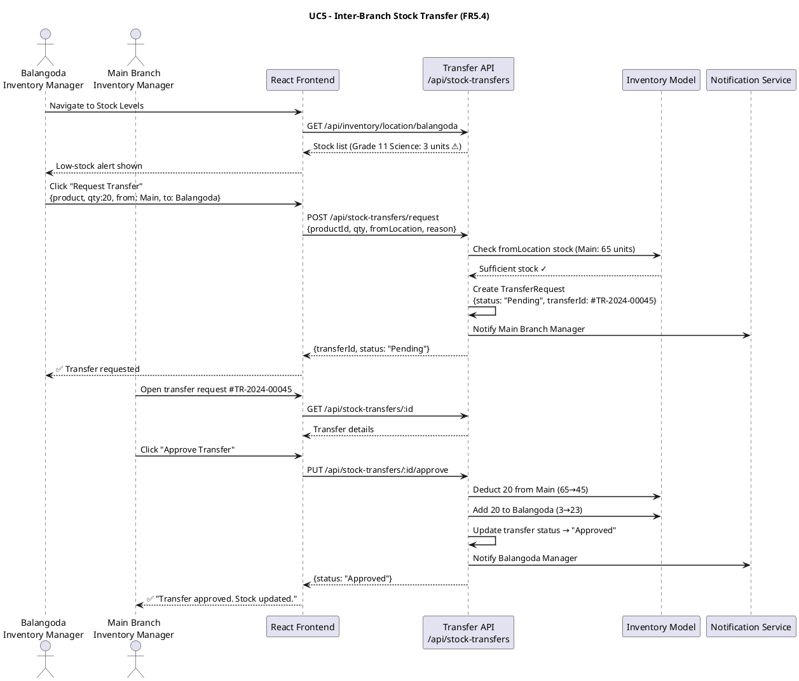
```plantuml
@startuml
title UC5 - Inter-Branch Stock Transfer (FR5.4)
skinparam sequenceArrowThickness 1.5
actor "Balangoda\nInventory Manager" as Mgr1
actor "Main Branch\nInventory Manager" as Mgr2
participant "React Frontend" as FE
participant "Transfer API\n/api/stock-transfers" as API
participant "Inventory Model" as Inv
participant "Notification Service" as Notif

Mgr1 -> FE: Navigate to Stock Levels
FE -> API: GET /api/inventory/location/balangoda
API --> FE: Stock list (Grade 11 Science: 3 units ⚠️)
FE --> Mgr1: Low-stock alert shown

Mgr1 -> FE: Click "Request Transfer"\n{product, qty:20, from: Main, to: Balangoda}
FE -> API: POST /api/stock-transfers/request\n{productId, qty, fromLocation, reason}
API -> Inv: Check fromLocation stock (Main: 65 units)
Inv --> API: Sufficient stock ✓
API -> API: Create TransferRequest\n{status: "Pending", transferId: #TR-2024-00045}
API -> Notif: Notify Main Branch Manager
API --> FE: {transferId, status: "Pending"}
FE --> Mgr1: ✅ Transfer requested

Mgr2 -> FE: Open transfer request #TR-2024-00045
FE -> API: GET /api/stock-transfers/:id
API --> FE: Transfer details
Mgr2 -> FE: Click "Approve Transfer"
FE -> API: PUT /api/stock-transfers/:id/approve
API -> Inv: Deduct 20 from Main (65→45)
API -> Inv: Add 20 to Balangoda (3→23)
API -> API: Update transfer status → "Approved"
API -> Notif: Notify Balangoda Manager
API --> FE: {status: "Approved"}
FE --> Mgr2: ✅ "Transfer approved. Stock updated."

@enduml
```

**Commentary:** This diagram shows the request-approval workflow for inter-branch transfers. The stock modification happens only after approval, and both managers are notified. The system prevents negative stock at the source location.

---

### 7.6 UML Sequence Diagram — UC6: Create & Apply Discount Coupon (FR6.1)

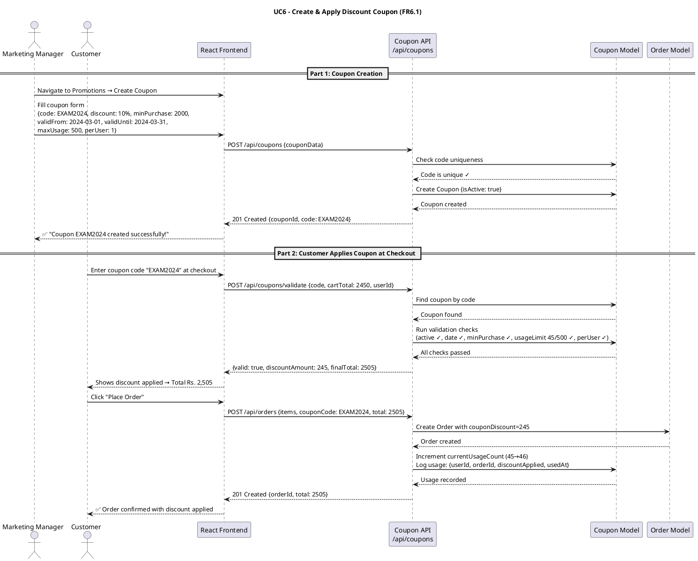
```plantuml
@startuml
title UC6 - Create & Apply Discount Coupon (FR6.1)
skinparam sequenceArrowThickness 1.5
actor "Marketing Manager" as MM
actor Customer
participant "React Frontend" as FE
participant "Coupon API\n/api/coupons" as API
participant "Coupon Model" as CouponDB
participant "Order Model" as OrderDB

== Part 1: Coupon Creation ==
MM -> FE: Navigate to Promotions → Create Coupon
MM -> FE: Fill coupon form\n{code: EXAM2024, discount: 10%, minPurchase: 2000,\nvalidFrom: 2024-03-01, validUntil: 2024-03-31,\nmaxUsage: 500, perUser: 1}
FE -> API: POST /api/coupons {couponData}
API -> CouponDB: Check code uniqueness
CouponDB --> API: Code is unique ✓
API -> CouponDB: Create Coupon {isActive: true}
CouponDB --> API: Coupon created
API --> FE: 201 Created {couponId, code: EXAM2024}
FE --> MM: ✅ "Coupon EXAM2024 created successfully!"

== Part 2: Customer Applies Coupon at Checkout ==
Customer -> FE: Enter coupon code "EXAM2024" at checkout
FE -> API: POST /api/coupons/validate {code, cartTotal: 2450, userId}
API -> CouponDB: Find coupon by code
CouponDB --> API: Coupon found
API -> CouponDB: Run validation checks\n(active ✓, date ✓, minPurchase ✓, usageLimit 45/500 ✓, perUser ✓)
CouponDB --> API: All checks passed
API --> FE: {valid: true, discountAmount: 245, finalTotal: 2505}
FE --> Customer: Shows discount applied → Total Rs. 2,505

Customer -> FE: Click "Place Order"
FE -> API: POST /api/orders {items, couponCode: EXAM2024, total: 2505}
API -> OrderDB: Create Order with couponDiscount=245
OrderDB --> API: Order created
API -> CouponDB: Increment currentUsageCount (45→46)\nLog usage: {userId, orderId, discountApplied, usedAt}
CouponDB --> API: Usage recorded
API --> FE: 201 Created {orderId, total: 2505}
FE --> Customer: ✅ Order confirmed with discount applied

@enduml
```

**Commentary:** This sequence covers the complete coupon lifecycle in two phases: creation by the Marketing Manager and redemption by a customer at checkout. The validation call is a separate pre-check (non-destructive); the usage count is only incremented upon successful order placement, preventing wasted quota from abandoned checkouts.

---

### 7.7 UML State Diagram — User Account Object (FR1.2)

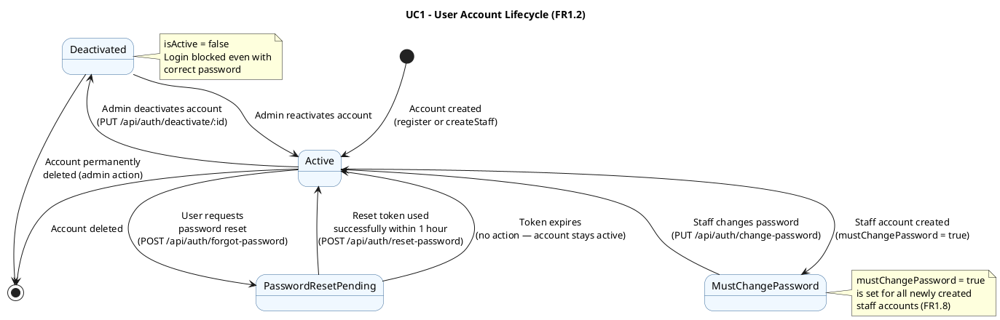
```plantuml
@startuml
title UC1 - User Account Lifecycle (FR1.2)
skinparam state {
  BackgroundColor #f0f8ff
  BorderColor #336699
}

[*] --> Active : Account created\n(register or createStaff)

Active --> MustChangePassword : Staff account created\n(mustChangePassword = true)
MustChangePassword --> Active : Staff changes password\n(PUT /api/auth/change-password)

Active --> Deactivated : Admin deactivates account\n(PUT /api/auth/deactivate/:id)
Deactivated --> Active : Admin reactivates account

Active --> PasswordResetPending : User requests\npassword reset\n(POST /api/auth/forgot-password)
PasswordResetPending --> Active : Reset token used\nsuccessfully within 1 hour\n(POST /api/auth/reset-password)
PasswordResetPending --> Active : Token expires\n(no action — account stays active)

Deactivated --> [*] : Account permanently\ndeleted (admin action)
Active --> [*] : Account deleted

note right of Deactivated
  isActive = false
  Login blocked even with
  correct password
end note

note right of MustChangePassword
  mustChangePassword = true
  is set for all newly created
  staff accounts (FR1.8)
end note

@enduml
```

**Commentary:** The `User` account object has multiple concurrent sub-states. A staff user enters the `MustChangePassword` sub-state immediately on creation, which must be resolved before full access is granted. Deactivation blocks login without deleting data, supporting account recovery. The `PasswordResetPending` state is transient — the token expires after 1 hour and the account automatically reverts to `Active` without any change.

---

### 7.8 UML State Diagram — Product Object (FR2.1)

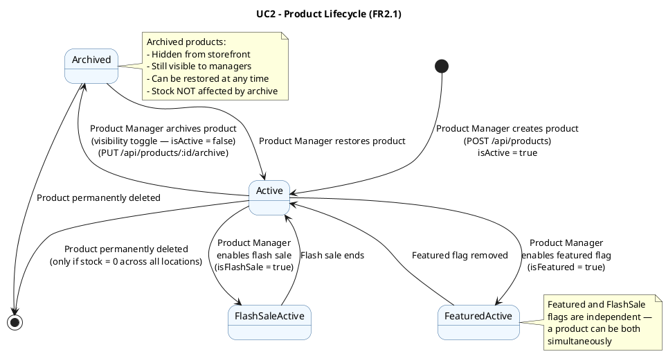
```plantuml
@startuml
title UC2 - Product Lifecycle (FR2.1)
skinparam state {
  BackgroundColor #f0f8ff
  BorderColor #336699
}

[*] --> Active : Product Manager creates product\n(POST /api/products)\nisActive = true

Active --> Archived : Product Manager archives product\n(visibility toggle — isActive = false)\n(PUT /api/products/:id/archive)
Archived --> Active : Product Manager restores product

Active --> FeaturedActive : Product Manager\nenables featured flag\n(isFeatured = true)
FeaturedActive --> Active : Featured flag removed

Active --> FlashSaleActive : Product Manager\nenables flash sale\n(isFlashSale = true)
FlashSaleActive --> Active : Flash sale ends

Active --> [*] : Product permanently deleted\n(only if stock = 0 across all locations)
Archived --> [*] : Product permanently deleted

note right of Archived
  Archived products:
  - Hidden from storefront
  - Still visible to managers
  - Can be restored at any time
  - Stock NOT affected by archive
end note

note right of FeaturedActive
  Featured and FlashSale
  flags are independent —
  a product can be both
  simultaneously
end note

@enduml
```

**Commentary:** The `Product` state machine separates visibility from deletion. `Archived` is a soft-delete — the product is hidden from the storefront but retained in the database with its inventory intact (per the codebase refactoring from a previous session). Permanent deletion is restricted to products with zero stock across all locations. The `FeaturedActive` and `FlashSaleActive` are orthogonal sub-states that can be combined independently.

---

### 7.9 UML State Diagram — Order Object (FR3.7)

The following state diagram shows all possible states of an `Order` object throughout its lifecycle.

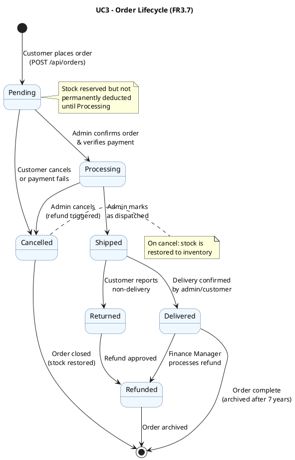
```plantuml
@startuml
title UC3 - Order Lifecycle (FR3.7)
skinparam state {
  BackgroundColor #f0f8ff
  BorderColor #336699
}

[*] --> Pending : Customer places order\n(POST /api/orders)

Pending --> Processing : Admin confirms order\n& verifies payment
Pending --> Cancelled : Customer cancels\nor payment fails

Processing --> Shipped : Admin marks\nas dispatched
Processing --> Cancelled : Admin cancels\n(refund triggered)

Shipped --> Delivered : Delivery confirmed\nby admin/customer
Shipped --> Returned : Customer reports\nnon-delivery

Delivered --> Refunded : Finance Manager\nprocesses refund

Cancelled --> [*] : Order closed\n(stock restored)
Returned --> Refunded : Refund approved
Refunded --> [*] : Order archived

Delivered --> [*] : Order complete\n(archived after 7 years)

note right of Pending
  Stock reserved but not
  permanently deducted
  until Processing
end note

note right of Cancelled
  On cancel: stock is
  restored to inventory
end note

@enduml
```

**Commentary:** The Order state machine shows seven valid states. Cancellation is allowed from `Pending` and `Processing` states, restoring stock to inventory each time. Once `Delivered`, the order is complete unless a refund is requested. `Returned` is an exception flow that routes into the `Refunded` terminal state.

---

### 7.10 UML State Diagram — PurchaseOrder Object (FR4.3)

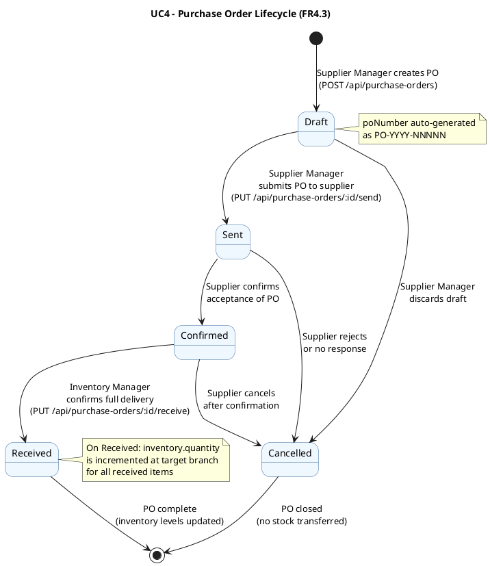
```plantuml
@startuml
title UC4 - Purchase Order Lifecycle (FR4.3)
skinparam state {
  BackgroundColor #f0f8ff
  BorderColor #336699
}

[*] --> Draft : Supplier Manager creates PO\n(POST /api/purchase-orders)

Draft --> Sent : Supplier Manager\nsubmits PO to supplier\n(PUT /api/purchase-orders/:id/send)
Draft --> Cancelled : Supplier Manager\ndiscards draft

Sent --> Confirmed : Supplier confirms\nacceptance of PO
Sent --> Cancelled : Supplier rejects\nor no response

Confirmed --> Received : Inventory Manager\nconfirms full delivery\n(PUT /api/purchase-orders/:id/receive)
Confirmed --> Cancelled : Supplier cancels\nafter confirmation

Received --> [*] : PO complete\n(inventory levels updated)
Cancelled --> [*] : PO closed\n(no stock transferred)

note right of Received
  On Received: inventory.quantity
  is incremented at target branch
  for all received items
end note

note right of Draft
  poNumber auto-generated
  as PO-YYYY-NNNNN
end note

@enduml
```

**Commentary:** The `PurchaseOrder` object moves through five states (Draft, Sent, Confirmed, Received, Cancelled). The `Received` terminal state triggers automatic inventory updates at the target branch location. Cancellation is permitted from any non-terminal state, allowing flexibility for supplier negotiations or order errors.

---

### 7.11 UML State Diagram — StockTransfer Object (FR5.5)

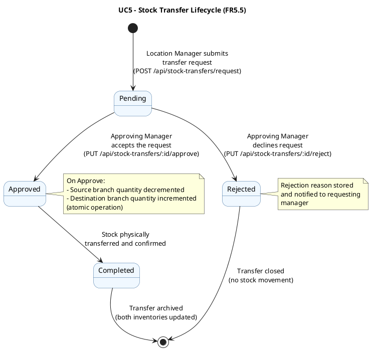
```plantuml
@startuml
title UC5 - Stock Transfer Lifecycle (FR5.5)
skinparam state {
  BackgroundColor #f0f8ff
  BorderColor #336699
}

[*] --> Pending : Location Manager submits\ntransfer request\n(POST /api/stock-transfers/request)

Pending --> Approved : Approving Manager\naccepts the request\n(PUT /api/stock-transfers/:id/approve)
Pending --> Rejected : Approving Manager\ndeclines request\n(PUT /api/stock-transfers/:id/reject)

Approved --> Completed : Stock physically\ntransferred and confirmed
Rejected --> [*] : Transfer closed\n(no stock movement)
Completed --> [*] : Transfer archived\n(both inventories updated)

note right of Approved
  On Approve:
  - Source branch quantity decremented
  - Destination branch quantity incremented
  (atomic operation)
end note

note right of Rejected
  Rejection reason stored
  and notified to requesting
  manager
end note

@enduml
```

**Commentary:** The `StockTransfer` state machine enforces a request-approval workflow. The actual stock movement (atomic increment/decrement of inventory at source and destination branches) only occurs on the `Approved` transition, preventing premature or unauthorised stock changes. Both the approved and completed states allow audit trail reconstruction.

---

### 7.12 UML State Diagram — Coupon Object (FR6.6)

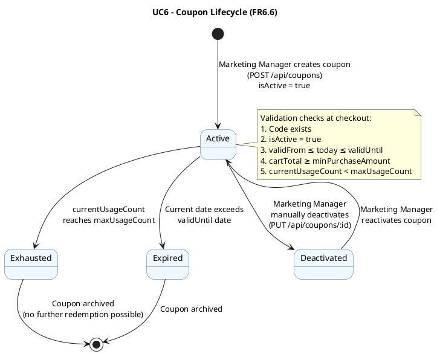
```plantuml
@startuml
title UC6 - Coupon Lifecycle (FR6.6)
skinparam state {
  BackgroundColor #f0f8ff
  BorderColor #336699
}

[*] --> Active : Marketing Manager creates coupon\n(POST /api/coupons)\nisActive = true

Active --> Exhausted : currentUsageCount\nreaches maxUsageCount
Active --> Expired : Current date exceeds\nvalidUntil date
Active --> Deactivated : Marketing Manager\nmanually deactivates\n(PUT /api/coupons/:id)

Exhausted --> [*] : Coupon archived\n(no further redemption possible)
Expired --> [*] : Coupon archived
Deactivated --> Active : Marketing Manager\nreactivates coupon

note right of Active
  Validation checks at checkout:
  1. Code exists
  2. isActive = true
  3. validFrom ≤ today ≤ validUntil
  4. cartTotal ≥ minPurchaseAmount
  5. currentUsageCount < maxUsageCount
end note

@enduml
```

**Commentary:** The `Coupon` object enters three possible terminal-like states depending on how it becomes invalid: exhaustion (usage limit reached), expiry (date passed), or manual deactivation by the Marketing Manager. Only `Deactivated` is recoverable — the Marketing Manager can reactivate a coupon. `Exhausted` and `Expired` states are permanent. All five checkout validation checks must pass for a coupon in `Active` state to be applied (FR6.6).

---

## 8. Flow Models

### 8.1 UML Activity Diagram — UC1: Admin Creates a Staff Account (FR1.4)

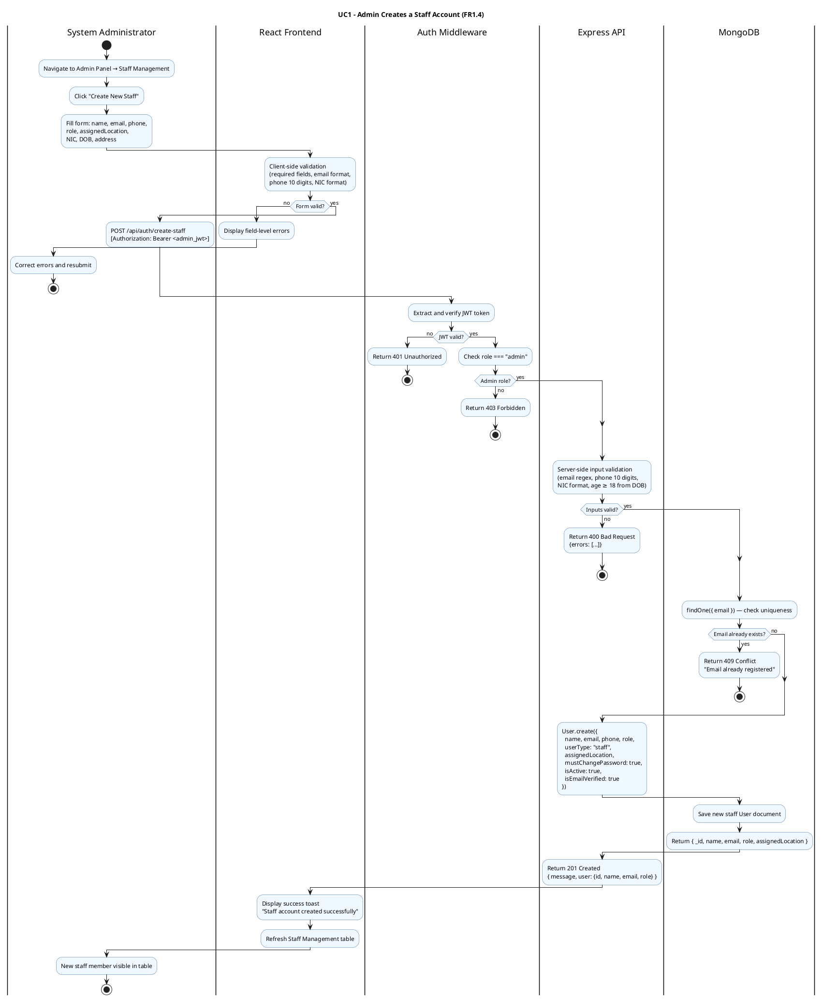
```plantuml
@startuml
title UC1 - Admin Creates a Staff Account (FR1.4)
skinparam activity {
  BackgroundColor #f0f8ff
  BorderColor #336699
}
skinparam partition {
  BorderColor #336699
  FontStyle bold
}

|System Administrator|
start
:Navigate to Admin Panel → Staff Management;
:Click "Create New Staff";
:Fill form: name, email, phone,\nrole, assignedLocation,\nNIC, DOB, address;

|React Frontend|
:Client-side validation\n(required fields, email format,\nphone 10 digits, NIC format);
if (Form valid?) then (no)
  :Display field-level errors;
  |System Administrator|
  :Correct errors and resubmit;
  stop
else (yes)
  :POST /api/auth/create-staff\n[Authorization: Bearer <admin_jwt>];
endif

|Auth Middleware|
:Extract and verify JWT token;
if (JWT valid?) then (no)
  :Return 401 Unauthorized;
  stop
else (yes)
  :Check role === "admin";
  if (Admin role?) then (no)
    :Return 403 Forbidden;
    stop
  else (yes)
  endif
endif

|Express API|
:Server-side input validation\n(email regex, phone 10 digits,\nNIC format, age ≥ 18 from DOB);
if (Inputs valid?) then (no)
  :Return 400 Bad Request\n{errors: [...]};
  stop
else (yes)
endif

|MongoDB|
:findOne({ email }) — check uniqueness;
if (Email already exists?) then (yes)
  :Return 409 Conflict\n"Email already registered";
  stop
else (no)
endif

|Express API|
:User.create({\n  name, email, phone, role,\n  userType: "staff",\n  assignedLocation,\n  mustChangePassword: true,\n  isActive: true,\n  isEmailVerified: true\n});

|MongoDB|
:Save new staff User document;
:Return { _id, name, email, role, assignedLocation };

|Express API|
:Return 201 Created\n{ message, user: {id, name, email, role} };

|React Frontend|
:Display success toast\n"Staff account created successfully";
:Refresh Staff Management table;

|System Administrator|
:New staff member visible in table;
stop

@enduml
```

**Commentary:** This swimlane activity diagram for FR1.4 clearly separates responsibilities across five lanes. The System Administrator owns the form interaction. The React Frontend handles client-side validation. The Auth Middleware performs the JWT verification and RBAC check before any business logic runs. The Express API executes server-side validation and constructs the user document. MongoDB persists the record. The `mustChangePassword: true` flag enforces FR1.8 on the staff member's first login.

---

### 8.2 UML Activity Diagram — UC2: Product Search & Filtering (FR2.4)

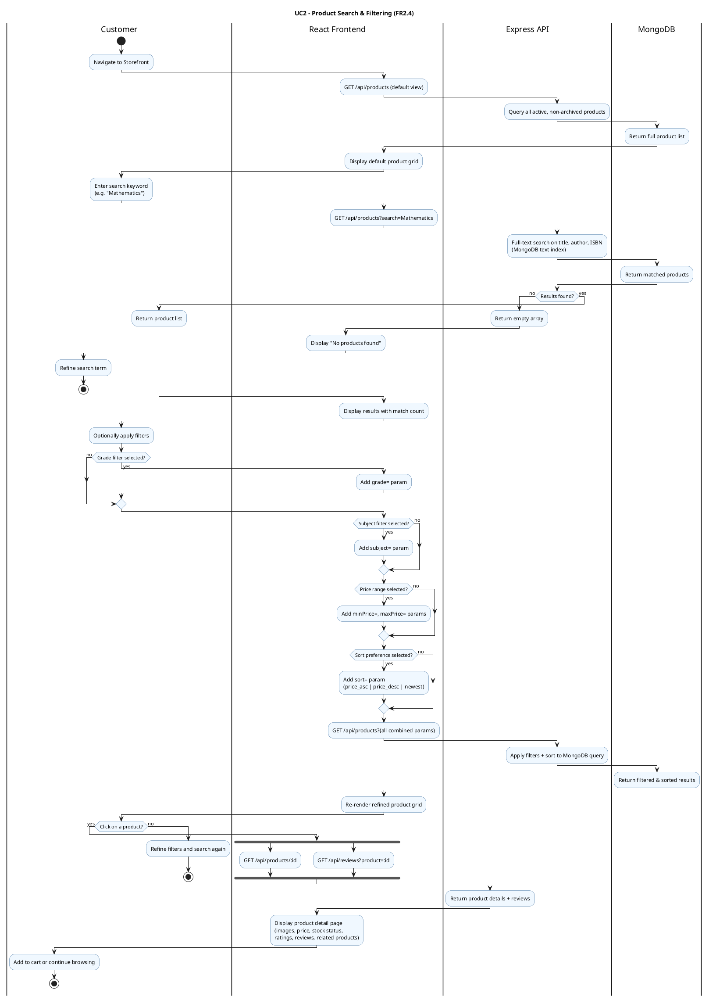
```plantuml
@startuml
title UC2 - Product Search & Filtering (FR2.4)
skinparam activity {
  BackgroundColor #f0f8ff
  BorderColor #336699
}
skinparam partition {
  BorderColor #336699
  FontStyle bold
}

|Customer|
start
:Navigate to Storefront;

|React Frontend|
:GET /api/products (default view);

|Express API|
:Query all active, non-archived products;

|MongoDB|
:Return full product list;

|React Frontend|
:Display default product grid;

|Customer|
:Enter search keyword\n(e.g. "Mathematics");

|React Frontend|
:GET /api/products?search=Mathematics;

|Express API|
:Full-text search on title, author, ISBN\n(MongoDB text index);

|MongoDB|
:Return matched products;

|Express API|
if (Results found?) then (no)
  :Return empty array;
  |React Frontend|
  :Display "No products found";
  |Customer|
  :Refine search term;
  stop
else (yes)
  :Return product list;
endif

|React Frontend|
:Display results with match count;

|Customer|
:Optionally apply filters;
if (Grade filter selected?) then (yes)
  |React Frontend|
  :Add grade= param;
else (no)
endif
if (Subject filter selected?) then (yes)
  |React Frontend|
  :Add subject= param;
else (no)
endif
if (Price range selected?) then (yes)
  |React Frontend|
  :Add minPrice=, maxPrice= params;
else (no)
endif
if (Sort preference selected?) then (yes)
  |React Frontend|
  :Add sort= param\n(price_asc | price_desc | newest);
else (no)
endif

|React Frontend|
:GET /api/products?{all combined params};

|Express API|
:Apply filters + sort to MongoDB query;

|MongoDB|
:Return filtered & sorted results;

|React Frontend|
:Re-render refined product grid;

|Customer|
if (Click on a product?) then (yes)

  |React Frontend|
  fork
    :GET /api/products/:id;
  fork again
    :GET /api/reviews?product=:id;
  end fork

  |Express API|
  :Return product details + reviews;

  |React Frontend|
  :Display product detail page\n(images, price, stock status,\nratings, reviews, related products);

  |Customer|
  :Add to cart or continue browsing;
  stop
else (no)
  :Refine filters and search again;
  stop
endif

@enduml
```

**Commentary:** The product search swimlane separates the customer's browsing intent from the frontend's query construction and the API/database's execution. Optional filters (Grade, Subject, Price, Sort) are shown as independent decision branches in the React Frontend lane — each adds a query parameter. The parallel fork when opening a product page reflects the simultaneous fetch of product details and reviews for performance (FR2.6).

---

### 8.3 UML Activity Diagram — UC3: Place Order with COD & Coupon (FR3.12)

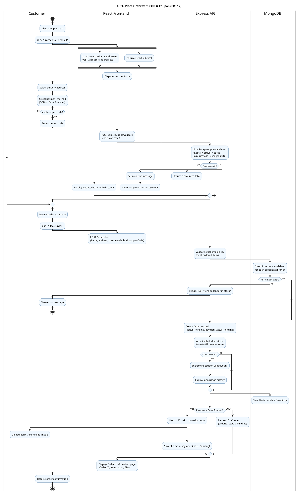
```plantuml
@startuml
title UC3 - Place Order with COD & Coupon (FR3.12)
skinparam activity {
  BackgroundColor #f0f8ff
  BorderColor #336699
}
skinparam partition {
  BorderColor #336699
  FontStyle bold
}

|Customer|
start
:View shopping cart;
:Click "Proceed to Checkout";

|React Frontend|
fork
  :Load saved delivery addresses\n(GET /api/users/addresses);
fork again
  :Calculate cart subtotal;
end fork
:Display checkout form;

|Customer|
:Select delivery address;
:Select payment method\n(COD or Bank Transfer);
if (Apply coupon code?) then (yes)
  :Enter coupon code;
  |React Frontend|
  :POST /api/coupons/validate\n{code, cartTotal};

  |Express API|
  :Run 5-step coupon validation\n(exists → active → dates →\nminPurchase → usageLimit);
  if (Coupon valid?) then (yes)
    :Return discounted total;
    |React Frontend|
    :Display updated total with discount;
  else (no)
    :Return error message;
    |React Frontend|
    :Show coupon error to customer;
  endif
else (no)
endif

|Customer|
:Review order summary;
:Click "Place Order";

|React Frontend|
:POST /api/orders\n{items, address, paymentMethod, couponCode};

|Express API|
:Validate stock availability\nfor all ordered items;

|MongoDB|
:Check inventory.available\nfor each product at branch;
if (All items in stock?) then (no)
  |Express API|
  :Return 400: "Item no longer in stock";
  |Customer|
  :View error message;
  stop
else (yes)
endif

|Express API|
:Create Order record\n{status: Pending, paymentStatus: Pending};
:Atomically deduct stock\nfrom fulfillment location;
if (Coupon used?) then (yes)
  :Increment coupon usageCount;
  :Log coupon usage history;
else (no)
endif

|MongoDB|
:Save Order, update Inventory;

|Express API|
if (Payment = Bank Transfer?) then (yes)
  :Return 201 with upload prompt;
  |Customer|
  :Upload bank transfer slip image;
  |Express API|
  :Save slip path {paymentStatus: Pending};
else (COD)
  :Return 201 Created\n{orderId, status: Pending};
endif

|React Frontend|
:Display Order confirmation page\n(Order ID, items, total, ETA);

|Customer|
:Receive order confirmation;
stop

@enduml
```

**Commentary:** This swimlane diagram separates the four active participants in order placement. The Customer drives the interaction. The React Frontend handles UI state, parallel data loads (addresses + subtotal), and form submission. The Express API runs all business rules (stock check, coupon validation, atomic stock deduction). MongoDB stores the final Order and updates Inventory. The bank transfer upload is an asynchronous branch specific to that payment method.

---

### 8.4 UML Activity Diagram — UC4: Create Purchase Order & Receive Stock (FR4.2)

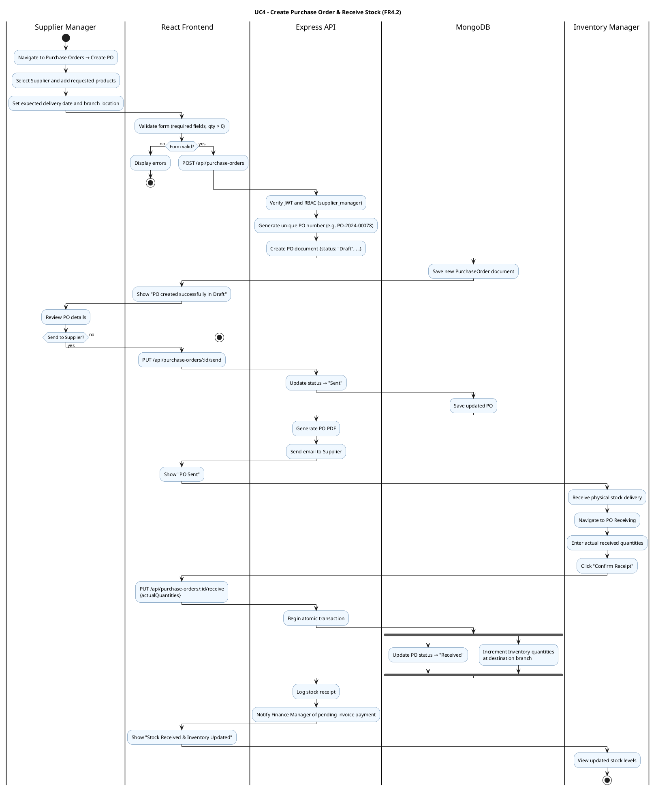
```plantuml
@startuml
title UC4 - Create Purchase Order & Receive Stock (FR4.2)
skinparam activity {
  BackgroundColor #f0f8ff
  BorderColor #336699
}
skinparam partition {
  BorderColor #336699
  FontStyle bold
}

|Supplier Manager|
start
:Navigate to Purchase Orders → Create PO;
:Select Supplier and add requested products;
:Set expected delivery date and branch location;

|React Frontend|
:Validate form (required fields, qty > 0);
if (Form valid?) then (no)
  :Display errors;
  stop
else (yes)
  :POST /api/purchase-orders;
endif

|Express API|
:Verify JWT and RBAC (supplier_manager);
:Generate unique PO number (e.g. PO-2024-00078);
:Create PO document {status: "Draft", ...};

|MongoDB|
:Save new PurchaseOrder document;

|React Frontend|
:Show "PO created successfully in Draft";

|Supplier Manager|
:Review PO details;
if (Send to Supplier?) then (yes)
  |React Frontend|
  :PUT /api/purchase-orders/:id/send;

  |Express API|
  :Update status → "Sent";

  |MongoDB|
  :Save updated PO;

  |Express API|
  :Generate PO PDF;
  :Send email to Supplier;

  |React Frontend|
  :Show "PO Sent";
else (no)
  stop
endif

|Inventory Manager|
:Receive physical stock delivery;
:Navigate to PO Receiving;
:Enter actual received quantities;
:Click "Confirm Receipt";

|React Frontend|
:PUT /api/purchase-orders/:id/receive\n{actualQuantities};

|Express API|
:Begin atomic transaction;

|MongoDB|
fork
  :Update PO status → "Received";
fork again
  :Increment Inventory quantities\nat destination branch;
end fork

|Express API|
:Log stock receipt;
:Notify Finance Manager of pending invoice payment;

|React Frontend|
:Show "Stock Received & Inventory Updated";

|Inventory Manager|
:View updated stock levels;
stop

@enduml
```

**Commentary:** This swimlane activity diagram models the lifecycle of a Purchase Order across three distinct user roles (Supplier Manager, Supplier via Email, and Inventory Manager). The workflow starts with draft creation and sending (Epic 4), and concludes with the Inventory Manager physically receiving the stock (Epic 5), which triggers an atomic MongoDB operation to simultaneously update the PO status and increment the real-time stock levels at the designated branch.

---

### 8.5 UML Activity Diagram — UC5: Inter-Branch Stock Transfer (FR5.4)

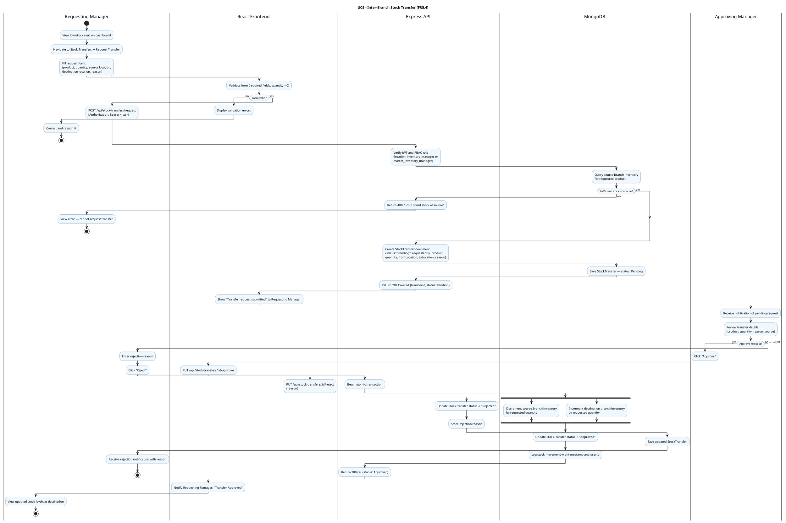
```plantuml
@startuml
title UC5 - Inter-Branch Stock Transfer (FR5.4)
skinparam activity {
  BackgroundColor #f0f8ff
  BorderColor #336699
}
skinparam partition {
  BorderColor #336699
  FontStyle bold
}

|Requesting Manager|
start
:View low-stock alert on dashboard;
:Navigate to Stock Transfers → Request Transfer;
:Fill request form:\n(product, quantity, source location,\ndestination location, reason);

|React Frontend|
:Validate form (required fields, quantity > 0);
if (Form valid?) then (no)
  :Display validation errors;
  |Requesting Manager|
  :Correct and resubmit;
  stop
else (yes)
  :POST /api/stock-transfers/request\n[Authorization: Bearer <jwt>];
endif

|Express API|
:Verify JWT and RBAC role\n(location_inventory_manager or\nmaster_inventory_manager);

|MongoDB|
:Query source branch inventory\nfor requested product;
if (Sufficient stock at source?) then (no)
  |Express API|
  :Return 400: "Insufficient stock at source";
  |Requesting Manager|
  :View error — cannot request transfer;
  stop
else (yes)
endif

|Express API|
:Create StockTransfer document\n{status: "Pending", requestedBy, product,\nquantity, fromLocation, toLocation, reason};

|MongoDB|
:Save StockTransfer — status: Pending;

|Express API|
:Return 201 Created {transferId, status: Pending};

|React Frontend|
:Show "Transfer request submitted" to Requesting Manager;

|Approving Manager|
:Receive notification of pending request;
:Review transfer details\n(product, quantity, reason, source);
if (Approve request?) then (yes)
  :Click "Approve";
  |React Frontend|
  :PUT /api/stock-transfers/:id/approve;

  |Express API|
  :Begin atomic transaction;

  |MongoDB|
  fork
    :Decrement source branch inventory\nby requested quantity;
  fork again
    :Increment destination branch inventory\nby requested quantity;
  end fork
  :Update StockTransfer status → "Approved";
  :Log stock movement with timestamp and userId;

  |Express API|
  :Return 200 OK {status: Approved};

  |React Frontend|
  :Notify Requesting Manager: "Transfer Approved";

  |Requesting Manager|
  :View updated stock levels at destination;
  stop
else (no — Reject)
  :Enter rejection reason;
  :Click "Reject";
  |React Frontend|
  :PUT /api/stock-transfers/:id/reject\n{reason};

  |Express API|
  :Update StockTransfer status → "Rejected";
  :Store rejection reason;

  |MongoDB|
  :Save updated StockTransfer;

  |Requesting Manager|
  :Receive rejection notification with reason;
  stop
endif

@enduml
```

**Commentary:** The stock transfer swimlane diagram clearly separates the two inventory manager roles — the Requesting Manager initiates the process while the Approving Manager has decision authority. The atomic fork in MongoDB ensures that stock is simultaneously decremented at the source and incremented at the destination, preventing any data inconsistency. All movements are logged with user and timestamp for audit purposes (NFR2.5).

---

### 8.6 UML Activity Diagram — UC6: Create & Apply Discount Coupon (FR6.1)

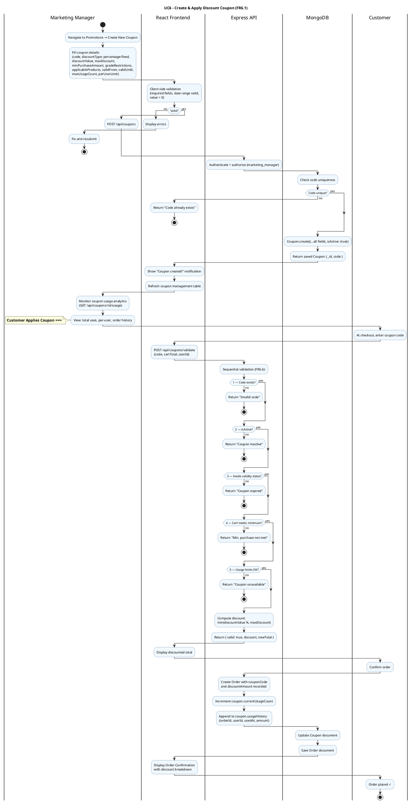
```plantuml
@startuml
title UC6 - Create & Apply Discount Coupon (FR6.1)
skinparam activity {
  BackgroundColor #f0f8ff
  BorderColor #336699
}
skinparam partition {
  BorderColor #336699
  FontStyle bold
}

|Marketing Manager|
start
:Navigate to Promotions → Create New Coupon;
:Fill coupon details:\n(code, discountType: percentage/fixed,\ndiscountValue, maxDiscount,\nminPurchaseAmount, gradeRestrictions,\napplicableProducts, validFrom, validUntil,\nmaxUsageCount, perUserLimit);

|React Frontend|
:Client-side validation\n(required fields, date range valid,\nvalue > 0);
if (Valid?) then (no)
  :Display errors;
  |Marketing Manager|
  :Fix and resubmit;
  stop
else (yes)
  :POST /api/coupons;
endif

|Express API|
:Authenticate + authorise (marketing_manager);

|MongoDB|
:Check code uniqueness;

if (Code unique?) then (no)
  |React Frontend|
  :Return "Code already exists";
  stop
else (yes)
endif

|MongoDB|
:Coupon.create({...all fields, isActive: true});
:Return saved Coupon { _id, code };

|React Frontend|
:Show "Coupon created!" notification;
:Refresh coupon management table;

|Marketing Manager|
:Monitor coupon usage analytics\n(GET /api/coupons/:id/usage);
:View: total uses, per-user, order history;

note
  === Customer Applies Coupon ===
end note

|Customer|
:At checkout, enter coupon code;

|React Frontend|
:POST /api/coupons/validate\n{code, cartTotal, userId};

|Express API|
:Sequential validation (FR6.6):;
if (1 — Code exists?) then (no)
  :Return "Invalid code";
  stop
else (yes)
endif
if (2 — isActive?) then (no)
  :Return "Coupon inactive";
  stop
else (yes)
endif
if (3 — Inside validity dates?) then (no)
  :Return "Coupon expired";
  stop
else (yes)
endif
if (4 — Cart meets minimum?) then (no)
  :Return "Min. purchase not met";
  stop
else (yes)
endif
if (5 — Usage limits OK?) then (no)
  :Return "Coupon unavailable";
  stop
else (yes)
endif

:Compute discount:\nmin(discountValue %, maxDiscount);
:Return { valid: true, discount, newTotal };

|React Frontend|
:Display discounted total;

|Customer|
:Confirm order;

|Express API|
:Create Order with couponCode\nand discountAmount recorded;
:Increment coupon.currentUsageCount;
:Append to coupon.usageHistory\n{orderId, userId, usedAt, amount};

|MongoDB|
:Update Coupon document;
:Save Order document;

|React Frontend|
:Display Order Confirmation\nwith discount breakdown;

|Customer|
:Order placed ✓;
stop

@enduml
```

**Commentary:** The 8.6 swimlane diagram provides the most complete view of the coupon lifecycle — from Marketing Manager creation through customer redemption and post-order recording. Unlike diagram 8.4, this version includes: grade/product restrictions in the creation form, per-user usage tracking, the `usageHistory` append operation, and the full audit trail stored in MongoDB. The five sequential validation gates are modelled in the Express API lane (FR6.6).

---

## 9. BPMN Process Models

### 9.1 BPMN — UC1: Admin Creates a Staff Account Process (FR1.4)

```text
Pool: UC1 - Staff Account Creation Process (FR1.4)
Lanes: System Administrator | API Gateway (Auth Middleware) | System (Backend)

[System Administrator]
  (Start Event: Need to onboard new staff member) →
  [Navigate to Admin Panel → Staff Management] →
  [Click "Create New Staff"] →
  [Fill Staff Creation Form:
    - Full Name
    - Email Address
    - Phone Number (10 digits)
    - Role (product_manager | finance_manager | supplier_manager |
            master_inventory_manager | location_inventory_manager | marketing_manager)
    - Assigned Location (Main Branch | Balangoda Branch | Kottawa Branch)
    - NIC Number
    - Date of Birth
    - Address] →
  [Submit Form] →
  <Client-Side Validation? Gateway>
    Fail → [Display field-level errors] → back to [Fill Staff Creation Form]
    Pass → ↓

[API Gateway (Auth Middleware)]
  (Receive POST /api/auth/create-staff) →
  [JWT Verification: Extract & Verify Bearer Token] →
  <JWT Valid? Gateway>
    No  → [Return 401 Unauthorized] → (End Event: Creation Failed)
    Yes → [RBAC Check: role === "admin"?] →
  <Admin Role? Gateway>
    No  → [Return 403 Forbidden] → (End Event: Creation Failed)
    Yes → ↓ (Pass to Backend)

[System (Backend)]
  (Receive Validated Request) →
  [Server-Side Input Validation:
    - Email format regex
    - Phone: exactly 10 digits
    - NIC: old (9 digits + V) or new (12 digits) format
    - Age: calculated from DOB must be ≥ 18 years] →
  <Inputs Valid? Gateway>
    No  → [Return 400 Bad Request with error list] → (End Event: Creation Failed)
    Yes → [DB Query: findOne({ email })] →
  <Email Already Exists? Gateway>
    Yes → [Return 409 Conflict: "Email already registered"] → (End Event: Creation Failed)
    No  → [Create User Document:
              { name, email, phone, role,
                userType: "staff",
                assignedLocation,
                mustChangePassword: true,
                isActive: true,
                isEmailVerified: true }] →
          [Return 201 Created:
              { message: "Staff account created successfully",
                user: { id, name, email, role, assignedLocation } }] →
          [Admin Panel: Display success toast] →
          [Staff table updates to show new member] →
  (End Event: Staff Account Created ✓)

note: Staff member receives login credentials separately (out-of-band).
      On first login, mustChangePassword = true forces immediate password change (FR1.8).
```

### 9.2 BPMN — UC2: Product Search & Filtering Process (FR2.4)

```text
Pool: UC2 - Product Search & Discovery Process (FR2.4)
Lanes: Customer | System (Frontend) | System (Backend API)

[Customer]
  (Start Event: On Storefront) → [Enter Search Keyword] →
  <Filters to Apply? Gateway>
    Yes → [Select Filters: Grade / Subject / Price Range] → ↓
    No  → ↓
  → <Sort Preference? Gateway>
      Yes → [Select Sort Order] → ↓
      No  → ↓
    → [View Product Results] →
    <Product Found? Gateway>
      Yes → [Click on Product Card] → [View Product Detail Page] →
            <Add to Cart? Gateway>
              Yes → [Add Product to Cart] → (End: Product Added)
              No  → [Continue Browsing] → back to View Product Results
      No  → [View "No Results" Message] →
            <Refine Search? Gateway>
              Yes → back to Enter Search Keyword
              No  → (End: Search Abandoned)

[System (Frontend)]
  (Receive User Input) → [Build Query Parameters (search, grade, subject, minPrice, sort)] →
  [Update URL State / React State] → [Trigger API Call] →
  (Receive Response) → [Render Product Grid / Detail Page] → (End)

[System (Backend API)]
  (Receive GET /api/products Request) → [Parse Query Parameters] →
  [Execute MongoDB Text & Filter Query] → [Apply Sort] → [Apply Pagination] →
  [Return Product List] →
  On product detail request: → [Fetch Product + Reviews in Parallel] → [Return Combined Data] → (End)
```

### 9.3 BPMN — UC3: Place Order with COD & Coupon (FR3.12)

```text
Pool: UC3 - Place Order with COD & Coupon Process (FR3.12)
Lanes: Customer | System | Admin/Finance

[Customer]
  (Start Event) → [Browse & Add to Cart] → [Proceed to Checkout] → [Enter Delivery & Payment] →
  <Coupon Applied? Gateway>
    Yes → [Enter Coupon Code] → [Coupon Valid? Gateway]
            Valid → [Discount Applied to Total]
            Invalid → [Error Shown] → [Re-enter / Skip]
    No → ↓
  → [Review Order Summary] → [Confirm Order] → [Intermediate Event: Wait for Delivery]
  → [Receive Delivery] → (End Event: Order Complete)

[System]
  → (Receive Order Request) → [Check Stock Availability] →
  <Stock OK? Gateway>
    No → [Send Stock Error to Customer]
    Yes → [Create Order Record] → [Deduct Stock] → [Send Confirmation Email] → [Update Order Status]
  → (Order Status Events: Pending → Processing → Shipped → Delivered)

[Admin/Finance]
  → [Review Order] → [Update Status to Processing] → [Arrange Dispatch] →
  [Update Status to Shipped] → [Confirm Delivery]
  <Bank Transfer? Gateway>
    Yes → [Verify Bank Slip] → [Update Payment Status → Paid]
    COD → [Collect Payment on Delivery] → [Update Payment Status → Paid]
```

> **Note for PDF submission:** Please render these BPMN descriptions using draw.io or Camunda Modeler. The textual notation above maps directly to BPMN 2.0 elements (pools, lanes, gateways, tasks, events).

### 9.4 BPMN — UC4: Create Purchase Order & Receive Stock (FR4.2)

```text
Pool: UC4 - Create Purchase Order & Receive Stock (FR4.2)
Lanes: Supplier Manager | Supplier (External) | Inventory Manager | Finance Manager

[Supplier Manager]
  (Start) → [Identify Restock Need] → [Create Draft PO] →
  [Select Products & Quantities] → [Set Delivery Date & Terms] → [Review PO] →
  [Send PO to Supplier] → (Intermediate: Wait for Delivery) → (End)

[Supplier (External Pool)]
  (Receive PO Email) → [Review PO] →
  <Accept? Gateway>
    Yes → [Confirm PO] → [Prepare & Dispatch Goods] → [Notify Inventory Manager]
    No → [Request PO Amendment] → back to Supplier Manager

[Inventory Manager]
  (Receive Delivery Notification) → [Check Delivered Items vs PO] →
  <All Items Correct? Gateway>
    Yes → [Confirm Full Receipt] → [Update PO Status: Received]
    No → [Record Discrepancy] → [Notify Supplier Manager]
  → [Update Inventory Levels] → (End)

[Finance Manager]
  (Receive Invoice Notification) → [Process Supplier Invoice] →
  [Record Payment] → [Update Supplier Balance] → (End)
```

### 9.5 BPMN — UC5: Inter-Branch Stock Transfer (FR5.4)

```text
Pool: UC5 - Inter-Branch Stock Transfer (FR5.4)
Lanes: Requesting Inventory Manager | System | Approving Inventory Manager

[Requesting Manager]
  (Start: Low Stock Alert) → [Check Other Branches for Stock] →
  [Fill Transfer Request Form] → [Submit Transfer Request] →
  (Intermediate: Wait for Approval Decision) →
  <Approved? Gateway>
    Yes → [Receive Transferred Stock] → (End: Stock Updated)
    No → [View Rejection Reason] → <Retry? Gateway>
           Yes → back to Fill Transfer Request
           No → (End: No Transfer)

[System]
  (Receive Transfer Request) → [Validate Source Stock] →
  <Stock Available? Gateway>
    No → [Return Error to Requester]
    Yes → [Create Transfer Record: Pending] → [Notify Approving Manager] →
          (Wait for Decision) →
          <Decision Gateway>
            Approved → [Deduct from Source] → [Add to Destination] → [Log Movement] → [Notify Both]
            Rejected → [Update Status: Rejected] → [Notify Requester]

[Approving Manager]
  (Receive Notification) → [Review Transfer Request] → [Check Own Stock Levels] →
  <Have Enough to Transfer? Gateway>
    Yes → [Approve Transfer] → (End)
    No → [Reject Transfer] → [Provide Reason] → (End)
```

### 9.6 BPMN — UC6: Coupon Creation & Redemption Process (FR6.1)

```text
Pool: UC6 - Coupon Lifecycle (FR6.1)
Lanes: Marketing Manager | Customer | System

[Marketing Manager]
  (Start: Promotion Campaign Planned) → [Design Coupon Rules] →
  [Create Coupon in System] → [Activate Coupon] →
  (Intermediate Timer: Coupon Active Period) →
  [Monitor Usage Analytics] →
  <Usage Limit Reached or Expired? Gateway>
    Yes → [Deactivate Coupon] → [Generate Campaign Report] → (End)
    No → [Continue Monitoring]

[Customer]
  (Start: At Checkout) → [Enter Coupon Code] →
  (Intermediate: Wait for Validation Response) →
  <Coupon Valid? Gateway>
    Yes → [Review Discounted Total] → [Complete Order] → (End)
    No → [View Error Message] → <Try Another Code? Gateway>
           Yes → back to Enter Coupon Code
           No → [Checkout Without Coupon] → (End)

[System]
  (Receive Validate Request) → [Lookup Coupon Code] → [Run Validation Checks] →
  [Return Result to Customer] →
  (On Successful Order) → [Increment Usage Count] → [Log Usage Record] → (End)
```

---

## 10. Decision Models

### 10.1 Decision Tables

#### 10.1.1 Decision Table — Staff Role Assignment (Epic 1: User Management)

| Condition | Rule 1 | Rule 2 | Rule 3 | Rule 4 |
|-----------|--------|--------|--------|--------|
| Requester has `admin` role JWT? | Yes | Yes | Yes | No |
| Target email already registered? | No | Yes | No | — |
| All required form fields valid? | Yes | Yes | No | — |
| **Action: Create Staff Account** | **✓** | ✗ | ✗ | ✗ |
| **Action: Return "Email already exists" error** | | ✓ | | |
| **Action: Return "Validation failed" error** | | | ✓ | |
| **Action: Return "403 Forbidden" error** | | | | ✓ |

#### 10.1.2 Decision Table — Product Visibility (Epic 2: Product Catalogue)

| Condition | Rule 1 | Rule 2 | Rule 3 | Rule 4 |
|-----------|--------|--------|--------|--------|
| Product is active (`isActive: true`)? | Yes | Yes | No | No |
| Product is archived (`isArchived: true`)? | No | Yes | No | Yes |
| **Action: Display to Customers (Storefront)**| **✓** | ✗ | ✗ | ✗ |
| **Action: Hide from Customers** | | ✓ | ✓ | ✓ |
| **Action: Display to Admin/Product Manager**| ✓ | ✓ | ✓ | ✓ |

#### 10.1.3 Decision Table — Inventory Stock Deduction on Order (Epic 3: Order Management)

| Condition | Rule 1 | Rule 2 | Rule 3 | Rule 4 |
|-----------|--------|--------|--------|--------|
| Customer is logged in? | Yes | Yes | No (Guest) | No (Guest) |
| All ordered items in stock at fulfillment branch? | Yes | No | Yes | No |
| **Action: Create order & deduct stock** | **✓** | ✗ | **✓** | ✗ |
| **Action: Return "Out of Stock" error** | | ✓ | | ✓ |
| **Action: Save cart for registered user** | ✓ | | ✗ | |

#### 10.1.4 Decision Table — Purchase Order Approval (Epic 4: Supplier Management)

| Condition | Rule 1 | Rule 2 | Rule 3 | Rule 4 |
|-----------|--------|--------|--------|--------|
| Target supplier is active in system? | Yes | Yes | Yes | No |
| Requested products belong to supplier? | Yes | Yes | No | — |
| Requester has `supplier_manager` role? | Yes | No | Yes | — |
| **Action: Create PO & Send to Supplier**| **✓** | ✗ | ✗ | ✗ |
| **Action: Return "Unauthorised" error**| | ✓ | | |
| **Action: Return "Invalid product" error**| | | ✓ | |
| **Action: Return "Supplier inactive" error**| | | | ✓ |

#### 10.1.5 Decision Table — Stock Transfer Execution (Epic 5: Inventory Management)

| Condition | Rule 1 | Rule 2 | Rule 3 | Rule 4 |
|-----------|--------|--------|--------|--------|
| Requested transfer quantity > 0? | Yes | Yes | Yes | No |
| Source branch has sufficient available stock?| Yes | Yes | No | — |
| Approving Manager Action | Approve | Reject | — | — |
| **Action: Execute atomic stock transfer** | **✓** | ✗ | ✗ | ✗ |
| **Action: Update transfer status to Rejected**| | ✓ | | |
| **Action: Return "Insufficient Stock" error**| | | ✓ | |
| **Action: Return "Invalid quantity" error**| | | | ✓ |

#### 10.1.6 Decision Table — Coupon Validation (Epic 6: Promotion Management)

| Condition | Rule 1 | Rule 2 | Rule 3 | Rule 4 | Rule 5 | Rule 6 |
|-----------|--------|--------|--------|--------|--------|--------|
| Coupon code exists in system? | No | Yes | Yes | Yes | Yes | Yes |
| Coupon is active? | — | No | Yes | Yes | Yes | Yes |
| Current date within validity period? | — | — | No | Yes | Yes | Yes |
| Cart total meets minimum purchase? | — | — | — | No | Yes | Yes |
| Usage limits not exceeded? | — | — | — | — | No | Yes |
| **Action: Apply Discount** | ✗ | ✗ | ✗ | ✗ | ✗ | **✓** |
| **Action: Show "Invalid code" error** | ✓ | | | | | |
| **Action: Show "Coupon inactive" error** | | ✓ | | | | |
| **Action: Show "Coupon expired" error** | | | ✓ | | | |
| **Action: Show "Min purchase not met" error** | | | | ✓ | | |
| **Action: Show "Coupon unavailable" error** | | | | | ✓ | |

---

### 10.2 Decision Trees

#### 10.2.1 Decision Tree — User Login Authentication (Epic 1)

```text
                     [User attempts login]
                              │
                    [Does email exist?]
                     /               \
                    NO               YES
                    │                 │
            ❌ "Invalid           [Is password correct?]
            Credentials"           /                  \
                                  NO                  YES
                                  │                    │
                          ❌ "Invalid             [Is account active?]
                          Credentials"             /                \
                                                  NO                YES
                                                  │                  │
                                          ❌ "Account          [Is mustChangePassword?]
                                           Deactivated"          /                  \
                                                               YES                  NO
                                                                │                   │
                                                        ⚠️ Prompt for        ✅ Issue JWT &
                                                        Password Change      Login Success
```

#### 10.2.2 Decision Tree — Product Search Filter Application (Epic 2)

```text
                      [Product Filter Applied]
                                 │
                        [Grade filter given?]
                        /                  \
                       YES                  NO
                        │                   │
                [Filter by Grade]     [Skip Grade]
                        │                   │
                        └───┬───────────────┘
                            │
                      [Subject filter given?]
                        /                  \
                       YES                  NO
                        │                   │
               [Filter by Subject]   [Skip Subject]
                        │                   │
                        └───┬───────────────┘
                            │
                      [Search keyword given?]
                        /                  \
                       YES                  NO
                        │                   │
                 [Apply full-text     [Return filtered
                   search query]        results]
                        │
                  [Return search
                     results]
```

#### 10.2.3 Decision Tree — Order Status Transition (Epic 3)

```text
                     [Admin Action on Order]
                              │
                  [Current status = PENDING?]
                   /                       \
                 YES                        NO
                  │                         │
         [Confirm order?]          [Current status = PROCESSING?]
         /             \            /                         \
       YES              NO        YES                          NO
        │               │          │                           │
  [Verify payment]    CANCEL   [Dispatch?]            [Current status = SHIPPED?]
        │           (restore     /      \              /                     \
  [Payment OK?]     stock)     YES       NO           YES                     NO
   /        \                   │        │             │                      │
  YES        NO               SHIP   CANCEL         MARK                 (No valid
   │          │             (status:  (refund      DELIVERED              transition)
PROCESS      ❌             Shipped)  triggered)  (status:
(status:   "Verify                               Delivered)
Processing)  Payment"
```

#### 10.2.4 Decision Tree — Purchase Order Lifecycle (Epic 4)

```text
                    [Purchase Order Created]
                               │
                       (Status: PENDING)
                               │
                      [Supplier Action]
                       /             \
                   APPROVE          REJECT
                     │                 │
              (Status: APPROVED)  (Status: CANCELLED)
                     │
             [Items Dispatched?]
                     │
               (Status: SHIPPED)
                     │
            [Inventory Manager receives]
               /                 \
        ALL ITEMS MATCH      DISCREPANCY
             │                   │
          CONFIRM             REPORT
             │                   │
    (Status: RECEIVED)    (Status: PARTIAL)
```

#### 10.2.5 Decision Tree — Low Stock Alert Triggering (Epic 5)

```text
                 [Inventory Level Updated]
                             │
                [Available Stock <= Threshold?]
                      /                   \
                    YES                    NO
                     │                     │
            [Is Alert Already             (Do
                Active?]                Nothing)
              /          \
            YES           NO
             │             │
            (Do         ✅ Trigger
          Nothing)      Low Stock
                          Alert
                             │
                     [Send Notification
                         to Manager]
```

#### 10.2.6 Decision Tree — Coupon Validation (Epic 6)

```text
                     [Coupon Code Entered]
                            │
                   [Does code exist?]
                   /                \
                 NO                 YES
                 │                   │
         ❌ "Invalid Code"   [Is coupon active?]
                              /            \
                            NO              YES
                            │               │
                   ❌ "Coupon          [Within validity dates?]
                    Inactive"          /              \
                                     NO               YES
                                     │                 │
                             ❌ "Coupon        [Min purchase met?]
                              Expired"         /             \
                                             NO               YES
                                             │                 │
                                    ❌ "Min          [Usage limits ok?]
                                    Purchase          /           \
                                    Not Met"        NO             YES
                                                    │               │
                                           ❌ "Not         ✅ APPLY
                                           Available"      DISCOUNT
```

---

## 11. Wireframes / Mock-up Diagrams

> The following wireframes represent key UI screens. For the final PDF submission, generate these screens using draw.io, Figma, Cacoo, or a similar tool using the layout descriptions below.

### 11.1 Homepage / Product Listing Page

**Layout Description:**
- **Header:** Logo (left) | Search bar (centre) | Cart icon with badge + Login/Profile (right)
- **Hero Section:** Promotional banner carousel (Featured books / Flash sales)
- **Filter Sidebar (left):** Grade filter checkboxes (6–13, O/L, A/L, Scholarship) | Subject filter | Price range slider | Reset filters button
- **Product Grid (right):** Responsive 3-column grid of product cards. Each card: product image, title, author, grade badge, price, star rating, "Add to Cart" button
- **Footer:** Links (About, Contact, Terms, Privacy) | Social media icons

### 11.2 Shopping Cart & Checkout Page

**Layout Description:**
- **Cart Section (left 60%):** Table with columns: Product image | Name | Unit price | Quantity stepper | Subtotal | Remove button. Below: Coupon code input + Apply button
- **Order Summary Panel (right 40%):** Subtotal | Discount | Delivery fee | Total (bold) | "Proceed to Checkout" button
- **Checkout Flow:** Delivery address selector (with "+ Add new address" link) | Payment method radio (COD / Bank Transfer) | Bank slip upload zone (shows if Bank Transfer selected)

### 11.3 Inventory Manager Dashboard

**Layout Description:**
- **Top Nav:** Logo | Role badge "Inventory Manager – Balangoda" | Notifications bell (badge count for low-stock alerts) | Logout
- **Sidebar:** Dashboard | Stock Levels | Receive Stock | Stock Transfers | Adjustments | Reports
- **Main Area — Stock Levels Table:** Search box + Export CSV button. Columns: Product | ISBN | Grade | Current Stock | Reserved | Available | Threshold | Status (badge: ✅ OK / ⚠️ Low / ❌ Out). Row actions: Adjust | Request Transfer
- **Low Stock Alert Banner:** Red banner at top listing all items below threshold

### 11.4 Admin Order Management Page

**Layout Description:**
- **Page Header:** "Order Management" | Date range picker | Status filter dropdown | Export button
- **Orders Table:** Columns: Order ID | Customer | Date | Items | Total | Payment Method | Payment Status | Order Status | Actions. Status badges use colour coding: Yellow=Pending, Blue=Processing, Purple=Shipped, Green=Delivered, Red=Cancelled
- **Order Detail Modal (on row click):** Order summary | Items list with images | Customer info | Delivery address | Payment info | Bank slip thumbnail (if Bank Transfer) | Status update dropdown + "Update" button

---

## 12. References

### Academic References

1. **Sommerville, I.** (2016). *Software Engineering* (10th ed.). Pearson Education Limited.
2. **Pressman, R. S., & Maxim, B. R.** (2020). *Software Engineering: A Practitioner's Approach* (9th ed.). McGraw-Hill Education.
3. **Pohl, K., & Rupp, C.** (2015). *Requirements Engineering Fundamentals* (2nd ed.). Rocky Nook.
4. **Cohn, M.** (2004). *User Stories Applied: For Agile Software Development*. Addison-Wesley Professional.
5. **Schwaber, K., & Sutherland, J.** (2020). *The Scrum Guide*. Scrum.org.
6. **Object Management Group (OMG)** (2017). *Unified Modeling Language Specification v2.5.1*. https://www.omg.org/spec/UML/

### Industry Standards

7. **IEEE Std 830-1998**. *IEEE Recommended Practice for Software Requirements Specifications*. IEEE.
8. **ISO/IEC/IEEE 29148:2018**. *Systems and software engineering — Requirements engineering*.
9. **Object Management Group (OMG)** (2013). *Business Process Model and Notation (BPMN) v2.0.2*. https://www.omg.org/spec/BPMN/
10. **BABOK® Guide v3** (2015). *A Guide to the Business Analysis Body of Knowledge*. IIBA.

### Tools and Resources

11. **PlantUML** (2024). Open-source UML diagramming. https://plantuml.com/
12. **draw.io / diagrams.net** (2024). Free online diagram tool. https://www.diagrams.net/
13. **Mermaid.js** (2024). Diagramming tool. https://mermaid.js.org/
14. **Lucidchart** (2024). UML and BPMN diagram reference. https://www.lucidchart.com/

### Project-Specific

15. *Methsara Publications – RE Assignment 1 Report* (2026). ISP_G05 internal document.
16. *Methsara Publications – Database Design Document* (2026). `docs/database_design.md`.
17. *Methsara Publications – Product Backlog* (2026). `docs/re-assignment/Product_Backlog_Table.md`.

---

## 13. Group Members Contribution Table

| Student ID | Student Name | Assignment 2 Contribution Areas |
|------------|--------------|----------------------------------|
| **IT24100548** | Galagama S.T | Refined FR1 & FR2, UML Class Diagram, Sequence Diagram UC1 (FR1.4), Activity Diagram UC1 (FR1.4), BPMN Model UC1 (FR1.4) |
| **IT24101314** | Appuhami H A P L | Refined NFR & Constraints, UML Physical (Deployment) Diagram, Sequence Diagram UC2 (FR2.4), Activity Diagram UC2 (FR2.4), Wireframes (Homepage, Cart) |
| **IT24100191** | Jayasinghe D.B.P | Refined FR3, State Diagram (Order Object), BPMN Model UC3 (FR3.12), Decision Table 1 (Coupon Validation), Decision Tree 1 (Coupon Validation) |
| **IT24100799** | Gawrawa G H Y | Refined FR4, Sequence Diagram UC5 (FR5.4), Activity Diagram UC5 (FR5.4), BPMN Model UC5 (FR5.4), Wireframe (Inventory Dashboard) |
| **IT24100264** | Bandara N W C D | Refined FR5, Sequence Diagram UC4 (FR4.2), Activity Diagram UC4 (FR4.2), BPMN Model UC4 (FR4.2), Decision Table 2 (Inventory Deduction) |
| **IT24101266** | Perera M.U.E | Refined FR6, Decision Tree 2 (Order Status), Wireframe (Admin Order Management), References, Document compilation and formatting |

### Work Distribution Verification

| Member | Estimated Hours | Contribution % |
|--------|----------------|----------------|
| IT24100548 (Galagama S.T) | 20 hours | 16.7% |
| IT24101314 (Appuhami H A P L) | 20 hours | 16.7% |
| IT24100191 (Jayasinghe D.B.P) | 20 hours | 16.7% |
| IT24100799 (Gawrawa G H Y) | 20 hours | 16.7% |
| IT24100264 (Bandara N W C D) | 20 hours | 16.7% |
| IT24101266 (Perera M.U.E) | 20 hours | 16.7% |
| **Total** | **120 hours** | **100%** |

---

## Appendices

### Appendix A: Glossary

| Term | Definition |
|------|------------|
| **BPMN** | Business Process Model and Notation — standard for business process modelling |
| **COD** | Cash on Delivery — payment method where customer pays upon receiving the order |
| **ER Diagram** | Entity-Relationship Diagram — structural model of the database |
| **MERN** | MongoDB, Express.js, React.js, Node.js — the technology stack used |
| **PO** | Purchase Order — document sent to a supplier to procure products |
| **RBAC** | Role-Based Access Control — access control method based on user roles |
| **SRS** | Software Requirements Specification — the complete requirements document |
| **UML** | Unified Modelling Language — standardised modelling language for software |
| **JWT** | JSON Web Token — stateless authentication token format |

### Appendix B: Key Assumptions

1. Users have stable internet access and basic digital literacy
2. Current supplier relationships and product catalogue structure (Grade/Subject/Exam) remain stable
3. Three branch locations (Main, Balangoda, Kottawa) are maintained in Phase 1
4. Staff members will receive system training before go-live
5. Existing inventory data will be migrated manually to seed the system

### Appendix C: Risk Register

| Risk ID | Description | Probability | Impact | Mitigation |
|---------|-------------|-------------|--------|------------|
| R1 | Scope creep during development | Medium | High | Fixed scope; defer changes to Phase 2 |
| R2 | Integration issues between epics | Medium | High | Continuous integration testing |
| R3 | Performance bottlenecks under load | Low | Medium | Performance testing in Sprint 3 |
| R4 | User adoption resistance | Medium | Medium | Training and onboarding plan |
| R5 | Data migration challenges | Low | High | Pilot migration with rollback plan |

---

**Document Version:** 1.0  
**Date:** March 2026  
**Classification:** Public-SLIIT  
**Group:** ISP_G05  

---

*End of RE Assignment 2 SRS Document*
